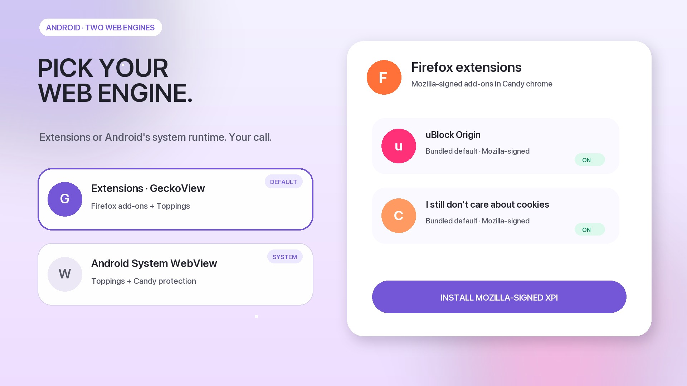
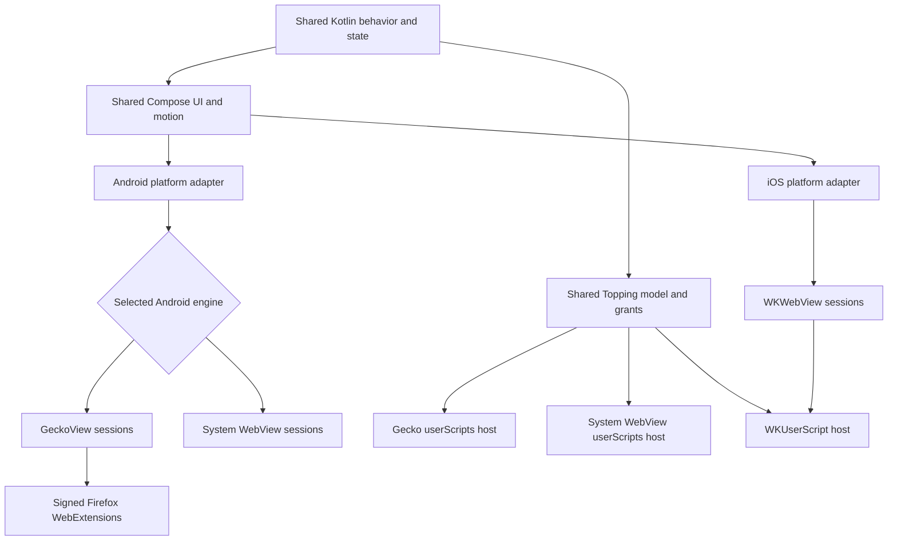
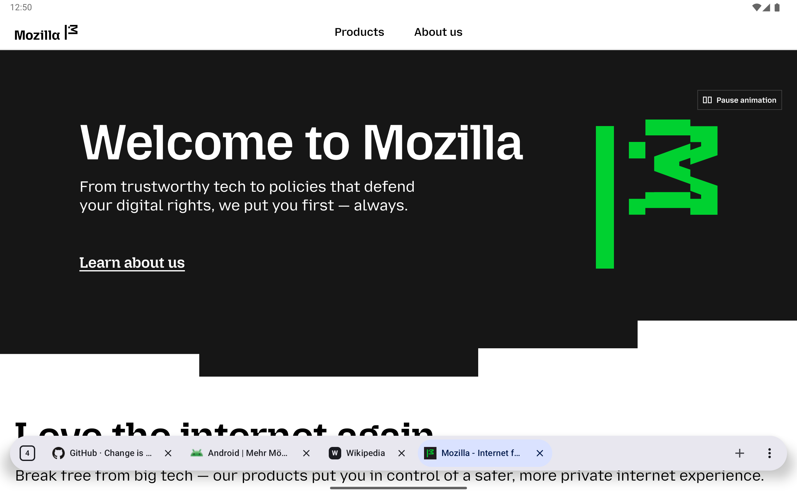

<p align="center">
  
</p>

<h1 align="center">Candy Browser</h1>

<p align="center">
  <strong>Firefox extensions on Android, powered by GeckoView.</strong><br>
  A gesture-first browser with selectable GeckoView and Android System WebView engines,
  an iOS WKWebView/Liquid Glass target, and local privacy tools.
</p>

<p align="center">
  <a href="https://github.com/sk2andy/candy-browser/releases"></a>
  
  
  
  <a href="LICENSE"></a>
</p>

<p align="center">
  <a href="https://sk2andy.github.io/candy-browser/"><strong>GitHub Pages website</strong></a>
  ·
  <a href="https://sk2andy.github.io/candy-browser/privacy/">Privacy</a>
  ·
  <a href="https://github.com/sk2andy/candy-browser/releases">Releases</a>
</p>

## 🎉 Firefox extensions on Android

Candy uses GeckoView by default and supports Mozilla-signed Firefox extensions directly inside the
Android app. A fresh Gecko profile comes with **uBlock Origin** and
**I still don't care about cookies**, while additional compatible extensions can be installed and
managed from Candy's browser settings.

Extension actions, popups, options, permissions, updates, and enable/disable controls stay inside
Candy's browser chrome. See [Platform engines](docs/browsing/platform-engines.md#android-gecko-and-extension-invariants)
for the supported GeckoView integration and current compatibility boundaries.

<p align="center">
  <a href="https://buymeacoffee.com/sk2andy"></a>
</p>

<p align="center">
  
  &nbsp;
  
  &nbsp;
  
</p>

## Cross-device sync

**Candy Sync turns every connected Android, Chromium, or Firefox device into a writable profile.**
Open a desktop profile on your phone to inspect its live tab list, open new tabs, navigate, pin,
reorder, or close them. The same small tab changes flow back to every connected client instead of
re-uploading the complete browser state.

<p align="center">
  
  &nbsp;&nbsp;
  
</p>

Changes are encrypted locally and written to a durable outbox. REST commits provide ordered,
retry-safe storage; authenticated WebSocket notifications deliver committed changes immediately.
After suspension or network loss, clients recover missing changes through REST.

### E2EE in short

The first client creates a random 256-bit workspace key. The immutable passphrase derives a local
recovery key with Argon2id; HKDF-SHA-256 derives purpose- and device-specific keys, and AES-256-GCM
encrypts and authenticates tab data. Every device also creates its own P-256 private key locally.
The passphrase, workspace key, private keys, URLs, titles, device names, and icons never reach the
server in plaintext—the server stores ciphertext plus the routing metadata required for sync.

### Start Candy Sync

```sh
cd sync/server
cp .env.example .env
# Set a unique username, password, public URL, and TLS host in .env.
# Never put the E2EE passphrase in server configuration.
docker compose pull candy-sync
docker compose up -d
```

The public `sk2andy/candy-sync:latest` image supports Linux AMD64 and ARM64. Contributors can still
build the server locally with `docker compose up --build -d`.

Build and load the WebExtension from `sync/extension/`, open its browser-managed Options Page, and
enter the endpoint plus an E2EE passphrase. In Candy Browser, open **Settings → Synchronization**
and join with the same endpoint, credentials, and passphrase.

See the [Candy Sync guide](docs/sync/README.md) for server deployment, local TLS, Chromium/Firefox
loading, Android setup, backups, protocol details, and the full security model.

### Candy Sync roadmap

- [ ] Add multi-user support
- [ ] Publish the extension to the Chrome Web Store and Mozilla Add-ons
- [x] Publish a prebuilt server image to Docker Hub
- [ ] Offer a hosted solution for people who do not want to self-host

## See Candy in motion

<p align="center">
  <a href="docs/promo/video/candy-browser-showcase-16x9.mp4">
    
  </a>
</p>

<p align="center">
  <a href="docs/promo/video/candy-browser-showcase-16x9.mp4"><strong>Watch or download the 16:9 feature showcase (MP4, 60 fps)</strong></a>
</p>

After its gesture-first opener, the showcase moves straight to the Android engine choice and Firefox
extensions. It then combines self-hosted Android/Chromium/Firefox tab sync with E2EE, live API 36 emulator
footage, current Topping scripts, and repository screenshots to show Link Peek, Spoilerfree Sports,
Hacker News Comfort, Privacy X-Ray, Reader Studio, Candy Trails, and profiles. Its original soundtrack,
kinetic typography, and camera motion are generated entirely from repository-owned sources.

## Why Candy?

- **Made for gestures.** Switch tabs from the address bar on phones, use a scrollable tab strip on
  wider screens, swipe into the visual overview, and dismiss cards with spring motion and haptic
  feedback.
- **Private by design.** Filtering, history, favorites, profiles, and privacy telemetry stay local.
- **Cross-device without surrendering your data.** Self-hosted E2EE sync exposes desktop and Android
  tab lists as writable device profiles while the server never sees their contents in plaintext.
- **Pick the engine that fits.** Use GeckoView for Mozilla-signed Firefox extensions such as uBlock
  Origin, or Android System WebView for Android's system-managed runtime while keeping Toppings and
  Candy protection.
- **Feels at home on Android.** Dynamic color, edge-to-edge content, Predictive Back, Autofill,
  passkeys, downloads, sharing, printing, and default-browser integration.

## Architecture

Candy keeps browser behavior and production UI in shared Kotlin. The address bar, gestures, menus,
tab switcher, Hero/Grid/List previews, settings structure, and their motion rules are not rebuilt for
each platform. Small platform adapters connect that shared product layer to the native browser engine,
image types, resources, haptics, and visual effects.



Android defaults to GeckoView and can switch the whole app to Android System WebView from Browser
settings. Candy checkpoints tab URLs and restarts into a fresh process, keeping tabs, bookmarks,
history, profiles, and settings shared while cookies, logins, native back-forward lists, and other
engine-owned session state stay separate. Firefox extensions remain available only in GeckoView;
System WebView keeps Toppings and Candy protection. iOS uses WKWebView behind
the same shared Kotlin contracts and Compose browser chrome, with native Liquid Glass supplied through
an iOS effect adapter.

Implementation boundaries, invariants, and the current parity status are documented in
[Platform engines](docs/browsing/platform-engines.md) and
[Platform feature parity](docs/browsing/platform-feature-parity.md).

## Tablet and Foldable support

At 600 dp and wider, the floating address bar shows a horizontally scrollable tab strip. Tap
another tab to open it, or tap the current tab to edit its address. Configurable actions and the
More menu stay in place. Horizontal swipes scroll the strip; the upward overview gesture remains.
The visual tab overview also adapts its previews and grid to larger screens.

<p align="center">
  <br>
  <em>Tablet browsing with floating, scrollable tabs and website favicons.</em>
</p>

<p align="center">
  <br>
  <em>Unfolded foldable layout with the same tab strip and fixed browser actions.</em>
</p>

## Features

### Browsing and gestures

- Floating chrome over edge-to-edge browser-engine content, with configurable actions around the
  address field or wide-screen tab strip and a docked edge mode
- Pull to refresh, direct URL navigation, QR scanning, local domain completion, and optional
  provider-backed search suggestions (disabled in private tabs)
- Google, DuckDuckGo, Bing, Brave, Ecosia, Startpage, Qwant, Kagi, Perplexity, ChatGPT, and configurable SearXNG search
- Optional Google AI Mode routing through a toggleable address-bar logo, enabled from search settings
- Address commands with `>` for tab, profile, cache, cookie, and navigation actions
- **Candy Recall:** optional, profile-scoped local full-text search across visited pages from the
  normal address input, History, or `>recall`, with no private-tab or cloud indexing
- Background tabs, sharing, printing, external apps, assistant summaries, and built-in or external
  download managers
- **Link Peek:** long-press a link to inspect it in a live, disposable preview without creating a
  tab or history entry, then send it to a background tab through the pulsing plus target
- **External Link Preview:** optionally open links from other apps in a temporary Candy preview
  instead of creating a tab immediately. A compact bottom pill keeps the current host visible,
  combines the outlined **Open in Candy** action with its profile picker, and offers share, copy,
  find-in-page, and desktop-site actions before the page is promoted to a real tab. Temporary app
  switches keep the preview; explicitly opening Candy from its app icon, widget, or launcher
  shortcut discards it.

<p align="center">
  
  &nbsp;
  
</p>

### Appearance and browser chrome

- System, light, dark, and AMOLED appearances with Material You, Candy, or neutral color palettes
- Clear or frosted browser surfaces plus angular, rounded, or extra-rounded shapes
- Independent transparency controls for general browser chrome and the address bar, with adjustable
  live background blur where the selected Android engine and version support it

<p align="center">
  
</p>

### Tabs, profiles, and journeys

- Persistent tabs with saved page previews, favicons, pinning, reordering, and automatic cleanup
- Coverflow, compact grid, and preview-free list layouts
- **Candy Stacks:** group compatible tabs by name and color, choose the stack preview,
  collapse from the card marker in Coverflow or Grid, and choose Coverflow, Grid, or List for the
  folder-style member view
- Tab snoozing with scheduled returns, notifications, and a dedicated snoozed-tab manager
- Per-profile browser-engine storage isolation with private sessions kept in memory
- Optional profile controls for a simpler single-profile setup
- Private tabs that keep their session and journey data in memory only
- **Candy Trails:** persistent branching navigation graphs with pan, zoom, direct navigation,
  and forkable paths
- **Site Capsules:** profile-bound home-screen shortcuts with configurable navigation boundaries
  and minimal browser chrome

<p align="center">
  
  &nbsp;
  
</p>

<p align="center">
  
  &nbsp;
  
  &nbsp;
  
</p>

### Reading and page tools

- **Reader Studio:** local article extraction with typography, alignment, paper and night themes,
  offline saves, and text-to-speech
- Find in page with live match counts and previous/next navigation that stays visible above the
  keyboard
- **Toppings:** Candy's lightweight, transparent alternative to traditional browser extensions.
  Discover, install, update, toggle, import, and edit bounded userscripts that customize matching
  regular tabs without privileged browser or `GM_*` APIs. The reviewed catalog lives in
  [`candy-browser-toppings`](https://github.com/sk2andy/candy-browser-toppings), so new Toppings do
  not require a Candy Browser release
- Per-domain mute controls for silencing noisy sites
- Optional full immersive mode and a setting that prevents video autoplay

<p align="center">
  
</p>

### Firefox extension support

- A clean Android Gecko profile gets uBlock Origin and **I still don't care about cookies** by
  default from pinned, unmodified Mozilla-signed XPIs bundled for offline installation. Their
  corresponding GPL-3.0-only sources are pinned to immutable upstream Git commits.
- Existing installs are matched by Firefox extension ID and left unchanged. Disabling a default is
  respected; uninstalling it records a durable removal marker, so Candy does not restore it later.
  Default extensions are never enabled for private tabs without the user's explicit opt-in.
- Android can install Mozilla-signed Firefox extensions directly from an HTTPS XPI URL. Candy uses
  GeckoView for signature validation, permission approval, installation, updates, enable/disable,
  uninstall, and explicit private-browsing access.
- Failed installs retain GeckoView's reason: Candy distinguishes download, package integrity,
  storage, signature, identity, compatibility, platform support, Mozilla blocklist, enterprise-only,
  cancellation, and restart-required failures instead of showing one generic error.
- Supported extension UI stays inside Candy's shared browser chrome: browser/page actions, popups,
  and options pages do not introduce a second address bar, menu system, or tab switcher.
- Candy supports the public WebExtension APIs exposed by the pinned GeckoView 155 runtime. This is
  not a guarantee that every Firefox Desktop extension is compatible. Desktop-only APIs and fields
  GeckoView rejects before Candy can handle them cannot be emulated reliably. For example,
  `tabs.update({ muted: ... })` and `tabs.update({ pinned: ... })` are rejected by GeckoView 155's
  extension schema.
- See the tested [Firefox WebExtension capability matrix](docs/browsing/platform-engines.md#firefox-webextension-capability-matrix-geckoview-155)
  for supported APIs and exact platform boundaries.

Pinned source URLs, versions, hashes, licenses, and delivery modes live in
`app/src/gecko/assets/gecko_default_extensions/catalog.json`. Maintainers verify local assets with
`python3 scripts/generate_gecko_default_extensions.py verify`, audit both upstream files with
`python3 scripts/generate_gecko_default_extensions.py audit-remote`, and refresh the bundled XPI
only with `python3 scripts/generate_gecko_default_extensions.py refresh`.

### Media, fullscreen, and picture-in-picture

- Native fullscreen support for HTML5 and YouTube video, including rotation-aware Android system UI
- Automatic Android picture-in-picture when leaving Candy with an active regular-tab video
- Website picture-in-picture buttons for eligible top-level and fullscreen-capable embedded HTML5 video
- Google Cast playback for compatible direct HTML5 MP4, WebM, HLS and DASH video in regular tabs
- Seamless PiP entry and return without pausing or recreating the decoder surface, even when a site
  replaces or restyles its video element
- Draggable in-app mini-player when switching tabs, plus background audio playback where supported
- Android media notification and system controls for play, pause, stop, and seek
- Private-tab media remains transient and never enters PiP, the mini-player, or system media controls

### Local protection

- EasyList/EasyPrivacy hosts and cosmetics, a pinned safely representable uAssets subset, and a
  pinned HaGeZi Pro host delta
- Third-party-cookie blocking and cosmetic cookie-banner hiding
- **Privacy X-Ray:** live per-tab block counts, categories, domains, and exceptions
- **Permission Radar:** per-site camera, microphone, location, and other WebView permission activity
- **Filter Studio:** global or profile rules, import/export, and confirmed HTTPS subscriptions
- Safe Browsing, TLS failure handling, blocked unsafe schemes, and external-scheme allowlisting

## Download

Candy Browser requires Android 13 (API 33) or newer.

[Download Candy Browser](https://github.com/sk2andy/candy-browser/releases)

Standard and User CA production builds check GitHub for updates at startup and offer a signed APK
for download. Standard installs on ARM64 devices prefer the smaller ARM64 APK and fall back to the
universal APK when needed. Both use the same application ID, version, and signing key, so either can
update an existing standard install. The FOSS build disables this updater. Android still requires
you to open a downloaded file and approve installation.

### Obtainium

Use the filtered setup link so Obtainium always selects the standard certificate-trust channel:

<a href="https://apps.obtainium.imranr.dev/redirect?r=obtainium%3A%2F%2Fapp%2F%7B%22id%22%3A%22dev.sk2andy.materialbrowser%22%2C%22url%22%3A%22https%3A%2F%2Fgithub.com%2Fsk2andy%2Fcandy-browser%22%2C%22author%22%3A%22sk2andy%22%2C%22name%22%3A%22Candy%20Browser%22%2C%22preferredApkIndex%22%3A0%2C%22additionalSettings%22%3A%22%7B%5C%22apkFilterRegEx%5C%22%3A%5C%22%5ECandyBrowser-v%5B0-9%5D%2B(%3F%3A%5C%5C%5C%5C.%5B0-9%5D%2B)%7B1%2C2%7D-release%5C%5C%5C%5C.apk%24%5C%22%7D%22%7D"></a>

The standard and User CA channels use separate application IDs, so both can stay installed and keep
independent profiles, settings, and caches. Keep the asset filter: it prevents Obtainium from
selecting a different channel than the configured app.

### F-Droid

Candy includes a separately installable `foss` distribution flavor for the official F-Droid
repository. It uses the application ID `dev.sk2andy.materialbrowser.foss`, removes Google Play
services, Google Cast, Google Code Scanner, and Candy's GitHub update checker, and keeps its profiles,
settings, and caches isolated from the other channels. Remote search suggestions default to off.
F-Droid builds this variant from tagged public source and verifies it against Candy's upstream-signed
FOSS APK.

The isolated F-Droid listing starts with `0.37`; older FOSS APKs used the universal application ID
and cannot become versions of the new package. Submission files and maintainer steps live in
[`distribution/fdroid`](distribution/fdroid/README.md). Candy publishes a signed FOSS reference APK
so F-Droid can verify its source build and preserve update compatibility with the upstream signing
key.

Releases contain four APK channels plus an architecture-optimized standard APK:

| APK suffix | Certificate trust | Intended use |
| --- | --- | --- |
| `-release.apk` | Android system CAs only | Universal compatibility fallback |
| `-arm64-v8a-release.apk` | Android system CAs only | Recommended smaller APK for ARM64 devices |
| `-systemwebview-release.apk` | Android system CAs only | Small, separately installed build using only Android System WebView |
| `-foss-release.apk` | Android system CAs only | F-Droid reproducible-build reference without proprietary Google integrations |
| `-ca-release.apk` | System CAs plus every CA in Android's user store | Explicit opt-in for HTTPS filtering/proxy tools such as AdGuard |

Both standard APKs use `dev.sk2andy.materialbrowser` and the same release signature. The System
WebView-only build uses `dev.sk2andy.materialbrowser.systemwebview`, the FOSS build uses
`dev.sk2andy.materialbrowser.foss`, and the User CA build uses
`dev.sk2andy.materialbrowser.ca`. Android therefore installs all four channels side by side with
isolated app data. Their launcher labels distinguish the channels; the warning under
**Settings → Protection & data** additionally identifies the User CA build's broader trust policy.
Updates stay on the installed channel. The System WebView build never downloads a GeckoView APK.

Releases through v0.36 used the standard application ID for all three APKs. Android cannot migrate
an installed package to a different application ID, so the isolated FOSS and CA channels start with
fresh app data. The new CA asset name is `-ca-release.apk`; legacy CA installs therefore do not get
offered an incompatible package as an in-place update.

**Security warning:** a trusted user CA can inspect and modify all HTTPS traffic made by Candy,
including normal and private tabs, suggestions, filter subscriptions, and update metadata. Only
install the User CA APK when you trust every CA in Android's user credential store and the software
that controls its private key. APK signature verification still protects Candy updates from APKs
signed by another key.

Advanced users who intentionally need this channel can use the
[filtered User CA Obtainium setup](https://apps.obtainium.imranr.dev/redirect?r=obtainium%3A%2F%2Fapp%2F%7B%22id%22%3A%22dev.sk2andy.materialbrowser.ca%22%2C%22url%22%3A%22https%3A%2F%2Fgithub.com%2Fsk2andy%2Fcandy-browser%22%2C%22author%22%3A%22sk2andy%22%2C%22name%22%3A%22Candy%20CA%22%2C%22preferredApkIndex%22%3A0%2C%22additionalSettings%22%3A%22%7B%5C%22apkFilterRegEx%5C%22%3A%5C%22%5ECandyBrowser-v%5B0-9%5D%2B(%3F%3A%5C%5C%5C%5C.%5B0-9%5D%2B)%7B1%2C2%7D-ca-release%5C%5C%5C%5C.apk%24%5C%22%7D%22%7D).

## Build from source

Requirements: Android SDK 37.1 and JDK 17. Point `JAVA_HOME` to your JDK 17 installation.

```bash
./gradlew testFullDebugUnitTest lintFullDebug assembleFullDebug
```

To verify the F-Droid-compatible build:

```bash
./gradlew testFossDebugUnitTest lintFossDebug assembleFossDebug
```

To verify the small System WebView-only build:

```bash
./gradlew testSystemwebviewDebugUnitTest lintSystemwebviewDebug assembleSystemwebviewDebug
./gradlew assembleSystemwebviewRelease
python3 scripts/test_systemwebview_apk.py
```

To build the explicit User CA development variant:

```bash
./gradlew testFullUserCaDebugUnitTest lintFullUserCaDebug assembleFullUserCaDebug
python3 scripts/test_network_security_apks.py
```

Debug APK: `app/build/outputs/apk/full/debug/app-full-debug.apk`. It installs as
`dev.sk2andy.materialbrowser.linkpeek`, uses the label `Candy Link Peek`, and has a badged launcher
icon, so it can stay installed beside the release app.

### Signed release builds

Release builds are minified with R8 and require a signing key. Never commit a keystore or its
credentials. Configure signing locally with either an ignored project file or environment variables.

For the first release only, create a long-lived key if no release key exists yet. Reuse that same key
for every later release:

```bash
mkdir -p .signing
keytool -genkeypair \
  -keystore .signing/candy-release.keystore \
  -storetype PKCS12 \
  -alias candy \
  -keyalg RSA \
  -keysize 4096 \
  -validity 10000
```

For an ignored project file:

```bash
cp keystore.properties.example keystore.properties
# Replace every placeholder in keystore.properties, then:
./gradlew assembleFullLocalRelease
```

Alternatively, export the same values from `~/.zshrc.shared`:

```bash
export CANDY_RELEASE_KEYSTORE_PATH=/absolute/path/to/project/.signing/candy-release.keystore
export CANDY_RELEASE_STORE_PASSWORD='replace-me'
export CANDY_RELEASE_KEY_ALIAS='candy'
export CANDY_RELEASE_KEY_PASSWORD='replace-me'
```

Signed local APK: `app/build/outputs/apk/full/localRelease/app-full-localRelease.apk`

`localRelease` installs beside the GitHub build as `dev.sk2andy.materialbrowser.local` and uses a
separate launcher icon and the label `Candy Browser Local`. GitHub update prompts are disabled for
this side-by-side build because production APKs cannot update its package. The GitHub release
workflow uses `assembleFullRelease`, `assembleFossRelease`, `assembleSystemwebviewRelease`, and
`assembleFullUserCaRelease`; those outputs use the standard, `.foss`, `.systemwebview`, and `.ca`
application IDs and matching launcher identities. A
separate workflow signs and publishes the FOSS output from explicitly allowlisted release tags.

For current edge-to-edge experiments, use the separate **Candy Edge** package consistently:

```bash
./gradlew lintFullLocalRelease assembleFullLocalRelease \
  -Pcandy.localReleaseApplicationIdSuffix=.edge \
  '-Pcandy.localReleaseAppLabel=Candy Edge' \
  -Pcandy.performanceDiagnostics=true
```

This signed, minified APK installs as `dev.sk2andy.materialbrowser.edge`, without replacing standard
Candy or sharing its app data. Its diagnostic authority is
`content://dev.sk2andy.materialbrowser.edge.performance`; launch the component
`dev.sk2andy.materialbrowser.edge/dev.sk2andy.materialbrowser.MainActivity`. Keep production release
identities unchanged. Device commands must use the explicitly selected serial.

### GitHub releases

The manual `Release Android APK` workflow tests the selected source revision, builds the FOSS flavor,
builds and verifies the signed universal standard, ARM64 standard, System WebView-only, and User CA
APKs, creates a `v<version>` source tag, and publishes the four signed GitHub APKs plus their SHA-256
checksums. Add four
repository secrets once:

```bash
base64 < "$CANDY_RELEASE_KEYSTORE_PATH" | gh secret set CANDY_RELEASE_KEYSTORE_BASE64
printf '%s' "$CANDY_RELEASE_STORE_PASSWORD" | gh secret set CANDY_RELEASE_STORE_PASSWORD
printf '%s' "$CANDY_RELEASE_KEY_ALIAS" | gh secret set CANDY_RELEASE_KEY_ALIAS
printf '%s' "$CANDY_RELEASE_KEY_PASSWORD" | gh secret set CANDY_RELEASE_KEY_PASSWORD
```

Pin the public certificate fingerprint separately. This prevents an accidentally replaced keystore
from publishing an APK that installed copies cannot update to:

```bash
keytool -exportcert \
  -keystore "$CANDY_RELEASE_KEYSTORE_PATH" \
  -storepass:env CANDY_RELEASE_STORE_PASSWORD \
  -alias "$CANDY_RELEASE_KEY_ALIAS" \
  | shasum -a 256 \
  | awk '{print $1}' \
  | gh variable set CANDY_RELEASE_CERTIFICATE_SHA256
```

The separate `Publish F-Droid reference APK` workflow builds without access to signing secrets, then
passes the unsigned APK to an isolated signing job that executes no repository code. It accepts only
explicitly allowlisted release tags and commits and uses Android Build Tools 34 for compatibility
with F-Droid's signature-copying process. Reference APKs disable the legacy v1/JAR signature and
enable modern APK signature schemes so F-Droid can copy the signature onto its independent build.
F-Droid accepts the resulting signed APK only when that build matches byte for byte apart from
signing.

The workflow uses the `release` GitHub environment. Configure required reviewers for that environment
if releases should require a manual approval after dispatch.

Before each release, update `candy.versionName` and the monotonically increasing
`candy.versionCode` in `gradle.properties`. The workflow rejects an input version that differs
from the committed version. Add the matching English changelog at
`release-notes/<version>.md`; it is bundled into Android’s one-time What’s New page and published
unchanged as the GitHub Release body. The project skill at
`.agents/skills/release-changelog/SKILL.md` documents the supported Markdown and screenshot format.
Then dispatch a release from GitHub Actions or with GitHub CLI:

```bash
gh workflow run release.yml \
  -f version=0.33 \
  -f changelog=release-notes/0.33.md \
  -f prerelease=false
```

### Google Play releases

The Play build uses the standard application ID `dev.sk2andy.materialbrowser`, targets API 36,
and disables Candy's GitHub update prompt. `bundleFullPlayRelease` produces one Android App Bundle
containing ARM64, ARMv7, x86, and x86_64 libraries; Google Play generates and serves only the
configuration APKs needed by each device.

Candy's Google Play developer account ID is `6525963931496038407`. This ID identifies the account
but is not a publishing credential. The Android Publisher API authenticates a narrowly permissioned
service account through GitHub's short-lived Workload Identity Federation credentials.

For seamless updates between existing GitHub installations and Google Play, configure Play App
Signing with the existing Candy release key as the **app signing key**. Do not let Play generate an
unrelated app signing key. Create a separate upload key for the GitHub workflow:

```bash
mkdir -p .signing
keytool -genkeypair \
  -keystore .signing/candy-play-upload.keystore \
  -storetype PKCS12 \
  -alias candy-play-upload \
  -keyalg RSA \
  -keysize 4096 \
  -validity 10000
```

The `google-play` GitHub environment supplies four secrets and three variables:

| Kind | Name | Purpose |
| --- | --- | --- |
| Secret | `CANDY_PLAY_UPLOAD_KEYSTORE_BASE64` | Base64-encoded Play upload keystore |
| Secret | `CANDY_PLAY_UPLOAD_STORE_PASSWORD` | Upload keystore password |
| Secret | `CANDY_PLAY_UPLOAD_KEY_ALIAS` | Upload key alias |
| Secret | `CANDY_PLAY_UPLOAD_KEY_PASSWORD` | Upload key password |
| Variable | `CANDY_PLAY_UPLOAD_CERTIFICATE_SHA256` | Pinned upload certificate digest |
| Variable | `GCP_WORKLOAD_IDENTITY_PROVIDER` | Full Google Cloud WIF provider name |
| Variable | `GCP_PLAY_SERVICE_ACCOUNT` | Play publisher service-account email |

Restrict the WIF attribute condition to repository `sk2andy/candy-browser` and environment
`google-play`. Allow either the reusable `job_workflow_ref` identity at `refs/heads/main` or the
direct `workflow_ref` identity for `publish-google-play.yml` on `main` and release tags matching
`v*`. Grant the service account access only to Candy in Play Console. Configure the `google-play`
GitHub environment to accept `main` and `v*` release tags. Automatic release publication must not
require a reviewer. The workflow builds without Google or signing credentials; only the separate
publish job can sign the AAB and request a short-lived Google credential. No service-account JSON
key is stored in GitHub.

The account must be verified and the app, declarations, Play App Signing, upload key, service
account access, and first internal release must be created once in Play Console. After that, publish
an existing GitHub release tag with:

```bash
gh workflow run publish-google-play.yml \
  -f version=0.42 \
  -f track=internal \
  -f status=completed
```

The Android release workflow directly invokes the reusable Play workflow after creating each GitHub
Release; this avoids GitHub's protection against recursively triggering workflows with
`GITHUB_TOKEN`. Stable releases publish to Play production and prereleases publish to Play beta. A
manually created GitHub Release also triggers the Play workflow. Manual dispatch from `main` remains
available for drafts and first uploads to internal test tracks. All paths check out the fully
qualified `v<version>` tag and require a corresponding published GitHub Release. The workflow also
requires matching English and German files at
`fastlane/metadata/android/<locale>/changelogs/<versionCode>.txt`, verifies their Play length limit,
the upload-key certificate, all four ABIs, the signed AAB, and the R8 mapping file. It defaults to a
draft internal release when dispatched manually. Manual production publication additionally requires
`-f production_confirmation=PROMOTE-TESTED-TO-PRODUCTION`. Each automatic release needs a new
`versionCode`; rerunning an already uploaded version can be rejected by Play. The release workflow
intentionally does not overwrite the Store listing.
Store descriptions and artwork in `fastlane/metadata/android` remain the canonical source for the
one-time Play Console setup and explicit later listing updates.

Publish a FOSS reference APK from an allowlisted release tag with:

```bash
gh workflow run publish-fdroid-reference.yml -f tag=v0.33
```

Before each later F-Droid release, add its exact tag and immutable commit to the workflow allowlist
through normal code review, then dispatch the workflow.

Android `versionCode` is stored in source so GitHub and F-Droid can build identical version
metadata from a tag. Tags and releases are created only after full and FOSS tests, release build
checks, APK signing, certificate pinning, and signature verification succeed. Back up the original
keystore and credentials securely: Android updates must always use the same signing key.

## Privacy and limitations

Candy offers GeckoView and Android System WebView as selectable Android engines and uses WKWebView for
the iOS target. It does not bundle a Chromium fork or route traffic through a proxy or VPN. Shared
Candy filtering policy stays local and crosses a platform-specific engine adapter.

Engine APIs still define the visibility boundary. WebSockets, CNAME cloaking, some redirects, and
content inside closed cross-origin or Shadow DOM contexts may get through. Firefox extensions can
use only GeckoView's public embedder surface; Firefox Desktop support does not imply GeckoView
support. Android System WebView and WKWebView cannot run Firefox extensions, so both use bounded
Toppings instead.

Privacy X-Ray includes only blocked requests that the active browser engine can reliably attribute to one tab.
Service-worker requests are filtered but excluded from per-tab telemetry when no reliable tab ID
is available.

Google Cast is used only after explicit device selection for compatible regular-tab video. Media
URLs and metadata are sent to the selected Cast device and remain memory-only in Candy. Google's
Cast Sender SDK can send Cast-device interaction activity to Google's logging service; release Data
Safety disclosures must account for the current SDK behavior.

<details>
<summary><strong>Candy Rules and filter-source details</strong></summary>

Candy Rules v1 supports exact host block/allow rules, positive site-to-host pairs, HOSTS entries,
and origin-scoped standard CSS selectors. It deliberately rejects JavaScript, regular expressions,
redirects, response-header filters, scriptlets, and advanced cosmetic operators rather than
approximating them.

Bundled EasyList/EasyPrivacy and uAssets cosmetics are compiled separately from user rules and
merged in memory so exceptions work across sources. Only domain-specific standard `##selector`
rules, their domain exclusions, and matching `#@#` exceptions are retained. Generic selectors,
conditional capability blocks, and procedural operators are skipped. Runtime lookup resolves
selectors for the current host before registering a bounded, exact-origin document-start script;
invalid browser-specific selectors fail independently through `insertRule`. Mail, Maps, and
Accounts Google hosts intentionally receive no bundled cosmetic CSS.

Bundled defaults may additionally use audited, declarative WebView rules: a site-scoped literal
request-path prefix or a known Reject/Remind-later consent control. These rules cannot run imported
JavaScript, never click Accept, and never intercept a main-frame navigation. An exact bundled path
rule may override the general same-party escape only for its audited page-host, request-host, and
literal non-root path prefix.

Imports are bounded and validated atomically. HTTPS subscriptions update only after a user-requested
fetch, show a diff, and require confirmation. Private-profile imports remain in memory.

EasyList, EasyPrivacy, and EasyList Cookie data are distributed under CC BY-SA 3.0 or later. The
uAssets-derived network and cosmetic subsets are generated from one pinned revision of the official
uBlock Origin Ads source and distributed under GPL-3.0. The HaGeZi Pro host delta is generated from
a pinned official revision and distributed under GPL-3.0. Exact sources, revisions,
transformations, and notices ship in `app/src/main/assets/`; maintenance entry points live in
`scripts/update_*.sh`.

</details>

## Languages

English, German, French, Portuguese, and Spanish.

## Licensing

Candy Browser source code is available under the [Mozilla Public License 2.0](LICENSE).
Third-party components and filter data retain their own licenses; bundled notices are available in
`app/src/main/assets/third_party_notices.txt` and inside the app.
