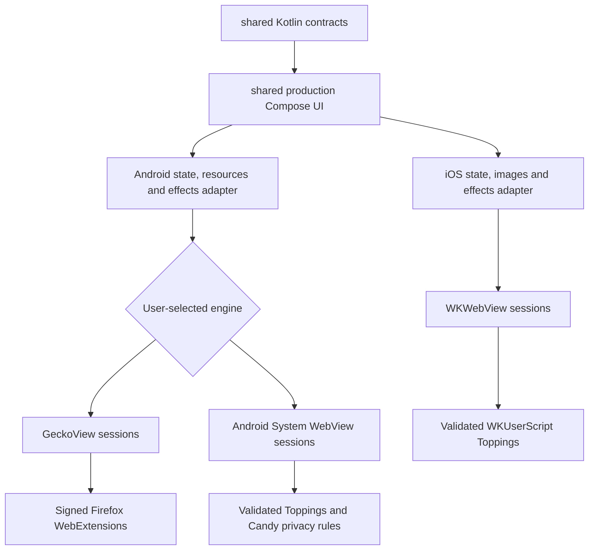

# Platform engines

Candy keeps browser behavior and shared production Compose UI in Kotlin while treating browser engines,
native images, resources and effects as platform adapters.

## Implemented boundary

| Concern | Shared Kotlin | Android | iOS |
| --- | --- | --- | --- |
| Address resolution | `CandySharedFacade` and `BrowserUrlResolver` | Consumed by the Gecko browser | Consumed by `BrowserViewModel` |
| Browser chrome behavior | Tabs, session commands/events, menu and gesture decisions; production main menu, Hero pager, Grid/List overview, overview bottom chrome, address-load rainbow and morph math | Calls the shared production composables with Android resources, images, haptics and blur effects | Calls the same composables from `CandyBrowserApp` with WebKit state and UIKit preview adapters |
| Settings core | Destination/router/home, common controls, Search provider catalog and URL routing, Appearance page, Tabs overview/dismiss controls, Browser translation-provider control and Toppings management | Supplies localized resources, chrome colors and persisted state | Uses the same pages; persists only stable search-provider settings before shared routing emits the generic WebKit load command; Toppings CRUD is bound to the validated WebKit runtime, unavailable backend settings are disabled |
| Web engine | No engine type crosses the boundary | `BrowserController` owns an engine port per tab; Settings selects GeckoView or Android System WebView for the next process | `BrowserViewModel` owns a WebKit adapter per tab |
| Customization | `Topping` metadata, frame-scope policy and injection plans | GeckoView supplies Firefox WebExtensions plus scoped Toppings; System WebView supplies scoped Toppings and Candy privacy rules | Scoped `WKUserScript` in a named content world |
| Visual language | Shared production menu/overview structure and semantic actions | Existing Candy Material theme, metrics, effects and resource resolution | Apple-style semantic colors, typography, compact metrics and native glass supplied through platform style/effect seams; no separate SwiftUI browser, menu or tab renderer |

The executable iOS target started as a vertical slice. Menu and tab-overview parity now comes from moving
the existing Android production composables into `commonMain`, not rebuilding them for Apple. Android and
iOS compile and call the same main menu, Hero pager, Compact Grid/List and overview bottom chrome. Android,
WebKit, UIKit and resource types never enter `commonMain`; small adapters provide images, strings, effects
and engine actions. The exact acceptance surface and evidence are defined in
[`platform-feature-parity.md`](platform-feature-parity.md).

Remaining iOS work is orchestration and platform adaptation: profile presentation, tab reorder and
overview entry/exit motion; favicon and incognito artwork adapters; menu actions whose settings, history,
snooze or other feature implementations do not exist on iOS yet; and native find/reader sheets. The
production Tab Actions menu source is present in `commonMain`, but iOS action-state wiring and platform
call-site cutover are not complete.

## Android engine selection

- Existing and new installs default to GeckoView. The Browser settings page can switch the whole
  Android app to System WebView; Candy checkpoints tab URLs, commits the choice and restarts into a
  fresh process so the inactive runtime does not remain in RAM.
- The separately installed `systemwebview` distribution fixes the engine to Android System WebView,
  removes the engine selector and ships no GeckoView runtime, Gecko native libraries, Privacy host,
  or bundled Firefox extensions. It uses package `dev.sk2andy.materialbrowser.systemwebview` and a
  dedicated GitHub release/update asset.
- Tabs, bookmarks, history, profiles and Candy settings remain shared. Cookies, logins, native
  back-forward lists and engine-owned session state intentionally stay separate.
- `AndroidBrowserEngineFactory` is the process-level seam. Concrete implementations live under
  `browser/gecko` and `browser/systemwebview`; a process creates sessions from exactly one factory.
- System WebView keeps Toppings, Candy filtering/cookie defaults, autoplay blocking, safe-area
  handling, navigation, downloads, uploads, prompts, profile isolation where AndroidX WebKit
  supports it, previews, Reader extraction, find, printing, media/fullscreen reporting and
  engine-local back-forward state. Firefox WebExtensions and their uBO filtering exist only in
  GeckoView mode.
- System WebView uses profile-scoped cookie managers for page loads, downloads and data deletion.
  Private profiles disable credential/autofill integration, use one process-local AndroidX WebKit
  profile and are removed on clean shutdown or before the next System-WebView process starts.
- Both Android engines prevent video autoplay by default. Turning that policy off is an explicit
  user choice because autoplay can increase page CPU/GPU work and battery use.
- WKWebView remains the fixed iOS adapter, making the product's three adapters GeckoView, Android
  System WebView and WKWebView while only Android presents an engine selector.

### Encrypted DNS

- Protection settings expose process-wide DNS-over-HTTPS choices for GeckoView: Android system DNS,
  Cloudflare, Google, Quad9, or a validated custom HTTPS endpoint such as a profile-specific NextDNS
  URL. The selected policy applies equally to regular and private tabs; private navigation never
  persists separate resolver state.
- Every configured HTTPS resolver uses GeckoView's strict `TRR_MODE_ONLY`. Page name lookups do not
  silently fall back to native DNS when the resolver fails. Resolver-host bootstrap and Android
  network services remain platform-owned and can still use system DNS. Choosing **System default**
  explicitly selects `TRR_MODE_DISABLED` and restores native DNS resolution.
- Persisted resolver policy is sanitized and installed while Candy creates its single Gecko runtime,
  before the first session can navigate. A malformed persisted custom endpoint is reset to **System
  default**. Live changes update the runtime for later resolutions without reloading open pages;
  existing connections are not terminated.
- Android System WebView exposes no supported per-WebView DNS configuration API. Candy therefore
  keeps the encrypted-DNS control visible but disabled in that engine and explains that System
  WebView continues to use Android system DNS.

### WebRTC protection

The protection settings expose one process-wide WebRTC choice for regular and private browsing,
including normal tabs, Link Peek and external-link previews. The stored default is **Protect IP
addresses**; unknown stored values fail back to that protected mode.

| Choice | GeckoView | Android System WebView |
| --- | --- | --- |
| Standard | Clears Candy's WebRTC overrides | Does not install a blocker |
| Protect IP addresses | Allows WebRTC only through a compatible proxy (`proxy_only`) | Blocks `RTCPeerConnection`, because WebView has no public proxy-only ICE policy |
| Disable WebRTC | Disables peer connections through Gecko's global privacy setting | Blocks `RTCPeerConnection` |

Gecko applies and verifies its global WebExtension browser settings before the Privacy host releases
the first page navigation. Policy transitions use fail-closed ordering: proxy-only is established
before peer connections are re-enabled, and peer connections are disabled before an obsolete IP
override is cleared. A setting controlled by another extension fails the Privacy host instead of
claiming protection.

System WebView installs the blocker in the page JavaScript world at document start for every frame,
before a page script can capture the constructor. Changing the mode installs or removes the handler
and reloads every factory-owned session. If an outdated WebView provider lacks document-start
injection, Candy disables page JavaScript while a protected mode is active rather than allowing an
unprotected connection. Temporary popup WebViews keep JavaScript explicitly disabled.
Camera and microphone permissions remain separate and continue through Candy's permission policy.

## Android Gecko and extension invariants

- `GeckoRuntimeOwner` creates exactly one `GeckoRuntime` for the app process. Sessions are cheap,
  independently closeable adapters around it.
- Candy reports every selected-tab transition through GeckoView's active-tab API. This keeps
  Firefox extension `tabs`, `webNavigation`, CSS injection and script injection scoped to the
  same tab that Candy's shared chrome presents.
- GeckoView `ScrollDelegate` events feed the pure,
  tab-scoped address-pill rule through a latest-value dispatcher. Its optimized mode starts at 30
  browser-chrome updates per second and steps down to 15 after sustained slow UI frames;
  fixed 120, 60, 30 and 15 Hz caps remain available in developer options. Only the selected
  tab's current renderer may update chrome;
  document-generation tags discard a callback queued before navigation, document top expands
  immediately, direction changes reset travel, and each tab retains its own
  compact state while background, replaced and closed sessions are ignored.
  API 34+ regression fixtures verify a real GeckoSession and the production controller-listener
  seam, including page scroll, Link Peek and tab/session replacement guards.
- Android keeps Candy's window, Gecko surface, and System WebView at the full edge-to-edge frame.
  Gecko forwards every safe-area edge, including the status-bar top,
  to CSS `env(safe-area-inset-*)` without shrinking the renderer. Normal Gecko tabs and Link Peek
  receive no legacy Candy document inset, and the Gecko-only bridge skips shared DOM repair
  installation before its observers, hooks or timers are created. A separate bounded Gecko CSS
  layer protects suitable body flow and viewport-bound fixed/sticky anchors once. Documents with
  `viewport-fit=cover` bypass that complete compatibility layer and use only Gecko's native
  `env(safe-area-inset-top)` values, avoiding duplicate offsets in full-height and IME layouts.
  Link Peek inside Compose safe-drawing hosts also keeps this correction disabled to avoid duplicating
  the host inset. Ordinary scrolling cancels obsolete work but never schedules
  geometry reads. Relevant additions/attribute changes are interaction-gated by default; developer
  controls can tune or disable that layer live. Classification has explicit node/time/ancestor
  bounds, so it is not a universal layout-protection guarantee. Verified unsupported overlaps retain
  the navigation-scoped emergency native top fallback; explicit native overrides remain available.
  Privacy and scroll metrics are unchanged.
  System WebView retains the document-start compatibility repair described below. There, Candy owns
  its normal-tab top safe area because `viewport-fit=cover` only opts into the
  viewport and does not prove that a page consumes `env(safe-area-inset-top)`. The renderer top
  safe area is therefore zero while side and bottom CSS safe-area values remain available.
  Every page receives a document-start compatibility inset: normal flow starts below the protected
  top and top-anchored fixed, sticky, absolute, or focused containers are shifted by the same stable
  amount. A sticky element whose site-owned `top` would enter the protected strip receives a stable
  safe-area-relative sticky anchor before it starts scrolling; the flow spacer therefore cannot scroll
  away underneath headers such as TapTap's. Candy reacts to new DOM and focus/input transitions, but
  never recomputes established moving offsets because of scrolling; an established offset survives
  site-owned hide/show, while a visible element that returns to normal flow has Candy's old translation
  removed. A passive animation-frame-bounded scroll check anchors a newly stuck top element before
  paint. When
  repeated verified layout failures cannot be repaired locally, Candy moves only the top edge into
  a native margin for that navigation; side and bottom rendering stays edge to edge.
  The explicit per-site **Force safe area** override moves every edge into native margins.
  Fullscreen remains truly edge to edge, while Compose safe-drawing hosts clear duplicate renderer
  insets.
  Candy always keeps GeckoView's default `SurfaceView` backend so page frames go directly to
  Android's compositor. On Android 17 and newer, Frosted address chrome maps its measured rounded
  bounds to a native `SurfaceView` blur region. Android 13, 14, 15 and 16 keep the same translucent
  glass overlay without website blur. System WebView remains in the ordinary View hierarchy and
  therefore retains live Frosted blur on every supported version from Android 13 onward.
- System WebView's shared safe-area compatibility script gives stable viewport-sticky elements a CSS `max()` top
  anchor with owned inline styling for Shadow DOM. Window scrolling does not read their geometry
  or rewrite their styling; relevant semantic mutations, viewport changes and policy reconfiguration
  revalidate author positioning. Nested scrollports and moving anchors retain sequential JS repair.
  Scroll-time JS work uses a separate set containing only non-CSS sticky elements it already
  owns; CSS-owned headers are not iterated. An empty set schedules no known-header frame unless
  scrolling occurs synchronously during an owned DOM write, before JS anchor registration completes.
  Author revalidation maintains membership when a header enters or leaves a nested/moving path.
  Broad hit-testing, Shadow DOM discovery and layout recovery run
  after both DOM and scroll quiet deadlines or on an explicit interaction, never once per fling frame.
  A new scroll replaces pending deferred recovery without resuming old geometry; dirty discovery
  authorization remains. Recovery coalesces redundant scroll-quiet protection while preserving
  independent emergency verification even when recovery is skipped or throws. Root, policy,
  scroll and quiet-request identities reject stale callbacks. Newly added subtrees
  also receive bounded added-only frame work during continuous scrolling; fixed children
  in offscreen wrappers remain eligible. It does not drain attribute roots or certify global
  safety. Scroll updates execution identity without starving the queued fresh-read wakeup;
  reconfiguration/disposal cancel it. Shadow DOM
  traversal uses point queries; observers cover open roots encountered on relevant visible paths.
  System WebView also observes newly attached open roots through a lifecycle-scoped shadow hook;
  Gecko's isolated content-script world does not hook page-owned prototypes. New or semantically
  changed subtrees receive a bounded, style-first priority walk; normal-flow nodes need no rectangle
  or ancestor scans. Added and attribute jobs receive separate alternating slots, with recent/FIFO
  turns inside each lane so recurring feed updates do not restart an unfinished cursor or starve a
  newly added control. Changes during a walk coalesce one fresh follow-up; removed or reparented
  child cursors also require that follow-up. The global 256-root cap preserves admission to an empty
  lane, but priority remains best-effort under overflow. Bookkeeping and bounded completion
  transitions share the cooperative task budget. This is early protection, not a replacement for
  conservative top-strip verification; queue completion is never a negative CSS safety proof.
- Safe-area discovery shares computed-style, geometry, Light-/Shadow-DOM parent paths (including
  null parents) and point-query reads only within one synchronous read epoch. Actual Candy layout
  writes invalidate before and after the setter, including reads from reentrant custom-element
  reactions and throwing setters. Invalidation allocates no collections; each reader allocates only
  its own collection when needed and publishes only if epoch/collection identities still match.
  Reentrant getters return their actual local value without poisoning newer reads; no ancestry cache survives a yield.
  The full synchronous mutation callback shares the same lazy epoch across record classification
  and immediate repair, without a viewport read for unrelated style-only classification. Owned CSS
  values/attributes are not rewritten. Sticky anchors remain sequential because an ancestor's
  update can move a nested scrollport before its child's geometry is read.
  Stable reconciliations reuse the existing candidate set; quiet scroll, relevant DOM changes,
  explicit interaction, resize and startup stabilization reopen discovery. Unknown containers and
  Shadow DOM changes remain conservative so viewport-fixed descendants cannot be skipped based
  on an offscreen parent rectangle. No new automatic native-inset fallback is introduced.
- Dense top-strip protection and late verification yield between packets of at most eight points,
  stopping after an approximately four-millisecond read budget. A single native hit-test can exceed
  that budget; it is not a hard task-time guarantee. Pending/cancelled discovery does not count as
  a confirmed layout failure. Only element identities and cursors cross task boundaries; changed
  navigation, policy, viewport, scrolling or author layout invalidate partial geometry. Tiny stable
  fixed controls can be protected earlier through fresh collision-checked priority validation.
  That JS path may accept an exact identity transform on the fixed element itself (such as
  `translateZ(0)`), without changing the author's transform or stacking context. Transformed ancestors,
  scaling, rotation, perspective and motion remain conservative; CSS sticky classification does not
  inherit this exception.
  Common header/control seeds retain the first inset row; the rotating dense grid prioritizes its
  trailing row so small controls at the lower status-bar boundary are not always last. Its scheduling
  cursor and seed/raster turn survive cancelled scroll/author-layout epochs, but no geometry, negative result or completed
  coverage does. Root, policy, inset, density and viewport/grid changes reset that hint. Continued
  discovery still needs actual task slots after synchronous sticky/priority work; even a one-hit
  window must alternate seeds and raster instead of restarting the same seed forever. Cancellation alone
  is never evidence of a performance win or safe layout.
  Unknown sticky headers share the same portioned point-discovery job. Dense hits perform style-only
  sticky registration; five just-below-inset points detect initially unstuck headers. Those points
  delay common seed probes without discarding them or stealing dense-grid progress. Both grids need
  fresh complete coverage before a positive protection result; cancellation retains scheduling hints
  only. Known nested/moving sticky repair stays sequential and immediate. Collision checks and
  exceptional targeted-flow repair remain separate costs.
  Initial CSS-sticky anchoring reuses existing top-background hits so owned-style observer delivery
  cannot leave a visible header unprotected before its first scroll. It adds no synchronous grid;
  nested/moving anchors retain sequential geometry. Style-hidden positioned elements skip rectangle reads.
  Layout viewport dimensions are read lazily once per synchronous read epoch; style-only mutation
  checks request none. Reconcile captures them before owned styling. They survive cache invalidation because document styling
  cannot resize the layout viewport; the next task/yield reads them anew. Element/style/point geometry
  still invalidates after every actual owned write.
  CSS height is resolved only for tall fixed-panel sizing, not ordinary header/control offset plans.
  Shadow point traversal selects the first unvisited root without reading unrelated later hosts;
  layer flattening preserves deepest-first order and deduplicates boxes without intermediate maps
  or reversing/copying the layer list.
  Fresh viewport validation counts toward each discovery packet's budget. A slow atomic validation
  still permits one point of progress rather than endlessly rescheduling; native queries can overshoot
  the cooperative target, so four milliseconds is not a hard execution ceiling.
- The optional draggable scrollbar reads bounded document metrics from Candy's authenticated,
  top-frame Gecko content bridge; GeckoView's Android view scrollbar metrics describe only the
  compositor host and are not a document-height API. The same overlay writes absolute offsets through
  the selected engine-session port on Gecko and System WebView. It never replaces Gecko's existing
  pill-collapse `ScrollDelegate` ownership.
- The status-bar treatment is a small static native sibling above the Gecko content container. It is
  limited to the status-bar height plus an 8dp fade tail and never uses a live blur. Clear chrome does
  not create a full-screen `BlurTarget`. Gecko Frosted chrome also never wraps the page in one;
  System WebView uses that explicit backdrop source for browser chrome.
- Android builds launch the normal `MainActivity`, `BrowserScreen`, address bar,
  gestures, menus and tab overview. `BrowserController` binds a `GeckoSession` renderer to each tab.
  Gecko content-process crashes and Android low-memory kills are both terminal session events. Candy
  removes the unusable session and its view, then lets the selected tab recreate its renderer from
  the latest eligible native session state or persisted URL instead of leaving a white loading surface.
  Renderer ownership is recorded before attaching its Android view because `addView` may synchronously
  re-enter Compose. Attach, release and host-transfer transitions are serialized: same-host re-entry
  reuses the recorded view, while a competing host retries on the next UI turn instead of asking one
  `GeckoSession` to create a second bound `GeckoView`. A renderer owned by the fullscreen/PiP
  presentation survives normal-host disposal and is never duplicated into a concurrently composed
  host.
  The view-host revision and controller session map are engine-neutral. Android WebView construction,
  clients, script bridges and profile effects stay inside the System WebView adapter.
- Gecko tab cards use `GeckoView.capturePixels()` and feed the bounded bitmap through Candy's
  existing preview quality, navigation-generation, private-tab and persistence gates. The same
  preview map continues to back hero, grid and list cards; private snapshots are never stored.
- Gecko link and image long-presses enter Candy through `ContentDelegate.onContextMenu`, then cross
  the session adapter as a normalized engine-neutral content target. The controller accepts only
  the selected current session at the unchanged navigation generation while the Activity is started
  and resumed. Window-focus loss, session deactivation and renderer detachment terminate an active
  Gecko touch stream with exactly one `ACTION_CANCEL`; this prevents Android's Home gesture from
  leaving Gecko's long-press timer alive in the background. Normal taps, selection, context menus
  and scroll streams remain owned by Gecko. Link Peek, Reader, find and printing all use that Gecko
  session instead of a second renderer.
- Reader Studio extraction crosses the selected Gecko session through Candy's internal, session-bound
  WebExtension content-script bridge. Returned JSON still passes the shared Reader extraction bounds
  and stale tab, URL and session guards before reaching UI state.
- GeckoView does not expose successful main-frame HTTP response codes through its session navigation
  delegate. Candy's authenticated internal Privacy WebExtension therefore forwards bounded
  `webRequest.onHeadersReceived` status messages for the bound main frame. Each response retains the
  request-time policy revision and navigation generation; the native host accepts only the current values
  and exact normalized page URL. HTTP 404 remains a committed navigation and
  drives the native Candy not-found surface; subresource responses never cross this path.
- External `ACTION_VIEW` previews use a transient Gecko session outside the normal tab/session maps.
  A session-id and generation guard rejects late navigation, find and lifecycle callbacks; the
  selected local profile supplies the Gecko context, and promotion reloads only the final normalized
  HTTP(S) URL into a regular tab. Preview history, desktop mode and find-in-page stay on that session,
  while external-app handoffs require the same bounded navigation grant as normal browsing.
- Gecko media uses GeckoView's native autoplay-permission and media-session delegates. The global
  autoplay blocker defaults on unless the user stored another choice, and is pushed to all live and
  new sessions; fullscreen-video state and commands stay
  bound to the exact selected session. Domain mute is applied to the current and every future native
  Gecko `MediaSession`; tab activity is not abused as an audio control. Existing audible and inaudible site permissions are updated
  through `StorageController` in their exact URI/context/private scope, read back, and only then
  reloaded. Private sessions never publish Android PiP or system media. GeckoView 155 still has an
  upstream race for synchronous audible `play()` before the asynchronous permission response; do not
  replace the native contract with injected JavaScript as a workaround.
- Gecko downloads, uploads, site permissions, HTTP authentication and web prompts cross focused,
  engine-neutral request models before reaching Candy UI or Android presenters. Every asynchronous
  result remains bound to its tab, Gecko session and navigation generation; selection, navigation,
  lifecycle exit or session replacement denies the pending request. File results accept only bounded
  readable `content://` URIs. Private permission decisions remain memory-only, and authentication
  credentials are neither stored nor logged.
- Gecko WebAuthn launches Android's passkey provider through the resumed `MainActivity`. Candy accepts
  `RESULT_OK` even when the provider returns no `Intent`, but completes Gecko's pending result only
  after the host resumes with the initiating tab, Gecko session and navigation generation unchanged.
  The source tab is exempt from immediate background eviction for that round trip; a stale or destroyed
  host rejects the result, and private mode gains no new persistence path.
- In-page attachment/blob downloads consume GeckoView's one-shot `WebResponse` body directly; Candy
  never closes it and re-fetches the URL through Android DownloadManager. This preserves POST bodies,
  authentication, redirects and private-session context. Context-menu and WebExtension downloads keep
  their original request inside Gecko. `GeckoWebExecutor`
  preserves method, headers, body, cache/conservative request policy and Gecko download flags; private
  owners additionally force Gecko's private fetch flag. Candy streams the response to a pending
  MediaStore Downloads row, commits only a complete file and deletes partial rows on failure, cancel
  or owner-session close. No cookie value crosses the engine boundary. External-link previews retain
  the stricter one-shot APK navigation grant.
  GeckoView 155 does not expose a session-context ID on `GeckoWebExecutor`: extension requests retain
  the authentication headers Gecko supplied, but Candy cannot promise that a newly built context-menu
  GET will select a particular profile cookie jar. Candy neither exports cookies nor uses private APIs
  to pretend otherwise.
- GeckoView 155 prompt policy is explicit. Candy presents alert, confirm, text, before-unload, repost,
  file and host-auth prompts. Explicit image/video capture uses a scoped MediaStore URI and honors
  Gecko's front (`USER`) versus rear (`ENVIRONMENT`) camera hint; cancellation, navigation, tab changes
  and lifecycle loss delete the pending row. Regular HTTPS login save/select uses Android Credential Manager without
  an app credential database; GeckoView also exposes its native virtual Autofill structure. FedCM
  provider, account and privacy-policy prompts use the engine-neutral credential host and reject
  private, inactive, cross-origin or stale requests. Address/card autocomplete, HTML automatic
  popups and client certificates remain fail closed. Choice, color, date/time and folder
  prompts use Candy's identity-bound prompt surface; Web Share requires explicit Candy confirmation
  before Android's Sharesheet is launched. GeckoView exposes only a certificate alias confirmation,
  not a safe Android key-selection contract, so Candy never auto-selects or confirms a certificate;
  no prompt silently falls through a nullable Gecko delegate default.
- Cleartext HTTP password-manager access is an explicit, default-off GeckoView-only Developer
  option with a separate warning confirmation. A user must tap a login field before Candy can open the default Android password manager;
  automatic filling and saving remain disabled. The option never expands FedCM, passkeys, private
  tabs, Link Peek or external-link previews. Android System WebView keeps Android Autofill enabled for
  supported secure pages, but its public API cannot mark selected HTTP origins as secure, so Candy
  shows the option disabled in that engine and recommends HTTPS or GeckoView.
- Main-frame navigation keeps Gecko's current/new target. User-activated `target=_blank` HTTP(S)
  loads enter a Candy-managed tab in the opener's exact profile/private context, while uBlock Origin
  owns filter-list popup and popunder blocking. GeckoView's unopened
  `NavigationDelegate.onNewSession` result is adopted into that Candy tab before Gecko opens it.
  The explicit per-site **Always block pop-ups** override remains Candy-owned. Normal Gecko tabs and
  external previews apply the same bounded external-app grant rules; unsafe/internal schemes,
  subframes and passive app redirects remain blocked.
  A user-tapped same-registrable-site redirector remains in Gecko rather than being mistaken for an
  external app link. Its short-lived navigation grant follows the real HTTP redirect, so only the
  resolved cross-site target is considered for a verified non-browser handoff.
- `AndroidBrowserEngineArchitectureTest` requires both runtime dependencies, rejects a compile-time
  engine flag and keeps Android WebView imports at the System WebView/userscript adapter edges.
- The existing tab residency limit now applies to Gecko sessions. Eviction persists eligible native
  session state, closes the renderer and retains the tab/preview/trail. Selection, media/PiP,
  permission/file/auth flows, preview capture and managed popup transitions protect their sessions.
- Clearing browsing data closes live tab, popup and preview renderers first, waits for Gecko's
  native clear-data completion, then clears Candy metadata. Profile deletion closes only that
  profile's sessions and uses `StorageController.clearDataForSessionContext(profileId)`; Gecko's
  context API reports dispatch only, with no completion callback. Profile moves invalidate old
  native snapshots so history from a different storage context is never restored.
- Android forwards renderer safe-area changes only for actual inset, attachment, session or size
  lifecycle events. Status-bar decoration stays in a static native overlay above GeckoView,
  outside the renderer and global-layout invalidation paths.
- Gecko Safe Browsing remains enabled. Candy's global third-party-cookie setting changes Gecko's
  runtime cookie behavior for both normal and private sessions. It uses `ACCEPT_FIRST_PARTY` while
  blocking is enabled. Because GeckoView 155 exposes no site-scoped override for that hard cookie
  policy, a confirmed SSO, CAPTCHA, or paused-site exception temporarily switches the shared runtime
  to `ACCEPT_ALL` before the matching main-frame load or native session restore starts. A queued load
  keeps that claim while the Activity is inactive, so bookmark results and unloaded tabs cannot begin
  under the stricter runtime default. Normal and private cookie modes are coordinated separately.
  Candy restores `ACCEPT_FIRST_PARTY` before cross-host main-frame navigation and when an inactive
  session finishes or cancels its pending navigation, loses the exception, or closes. Same-mode
  sibling sessions share Gecko's runtime setting and therefore see the temporary runtime setting too.
  Candy marks them inactive with Gecko's session lifecycle, but GeckoView does not document
  inactivity as a complete network suspension.
- Manual extension installation accepts only direct HTTPS URLs and delegates XPI parsing and Mozilla
  signature validation to GeckoView. The user must explicitly approve requested permissions;
  dismissal and lifecycle failure deny access.
- Android's Gecko runtime provisions two normal, deinstallable defaults through
  `WebExtensionController.install(..., INSTALLATION_METHOD_ONBOARDING)`. uBlock Origin `1.75.0`
  ships as the original Mozilla-signed AMO XPI, so a clean profile gets it without network access.
  `I still don't care about cookies` `1.1.9` ships the same way from its original Mozilla-signed AMO
  XPI. Both extensions therefore install on the first offline start. Their corresponding sources
  and licenses are pinned to Git commits `21f0e686506bb21b514b451c8c6cb9bf8c82d232` and
  `e763f24f79c5803774d28730649aef9aae3998ca`.
- Default permission approval exists only while Candy installs the exact catalog ID and version.
  Gecko still validates Mozilla's signature; bundled bytes must also match their pinned SHA-256.
  Private-browsing access is always denied. Default installation never uses `installBuiltIn` or
  grants GeckoView-only native-messaging privileges to third-party code.
- Provisioning deduplicates by stable extension ID and never replaces, downgrades, reenables, or
  changes private access on an existing install. A durable global marker records successful seeding.
  Only an explicit user uninstall creates a removal tombstone, which Candy persists before asking
  Gecko to uninstall. A provisioned-but-missing ID is retried because Gecko can report installation
  before its profile checkpoint reaches durable storage; an explicitly removed default still does
  not return on subsequent starts.
  This state contains only catalog IDs and no tab, URL, profile, or private-session data.
- uBlock Origin exclusively owns Gecko ad/tracker request and cosmetic filtering. Candy's native
  `ContentBlocker`, Candy Rules and popup/popunder filter lists remain WebKit-only. Gecko's internal
  host packages only the 4.9 KB Candy Cookie Defaults fallback alongside session-scoped Reader, PiP
  and compatibility-observation duties; it does not package or parse Candy ad-filter assets.
- Listing, enabling, disabling, updating, private-browsing opt-in and uninstalling use
  `WebExtensionController`. Built-in extensions cannot be mutated from Candy's manager.
- User-extension inventory and installation wait for the serialized Candy Topping and Privacy hosts
  to finish their own built-in registration. This prevents the internal-host startup writes from
  racing default provisioning or a profile extension install. Default provisioning then completes
  before user inventory/mutations. A failed internal-host initialization fails extension management
  instead of exposing a partially initialized Gecko registry.
- The existing manager's **Update** action calls GeckoView's signed AddonManager update path. Neither
  default manifest declares a custom `update_url`, so Gecko uses Mozilla's AMO update service by ID;
  new permissions still require the normal visible prompt. The pinned APK XPI is an initial seed,
  not a downgrade or forced update source.
- Installing, enabling, disabling, updating or uninstalling an extension reloads the selected
  non-blank Gecko page so navigation-driven scripts and styles cannot miss an already open tab.
  Changing only private-browsing access does not reload a regular page.
- Settings opens the extension manager as an overlay in the normal `MainActivity` and Candy chrome.
  Each installed extension with a valid options target exposes a Settings action beside its
  management controls. Dismissing that overlay returns to Settings instead of exposing the browser
  tab. Selecting that action opens the extension's options page in a session-only Candy tab. That
  tab replaces the address bar with a top app bar containing Back and the extension name. Extension
  content starts below that bar and uses native side and bottom safe-area margins instead of
  edge-to-edge document insets. Back closes the tab directly before returning to its opener; its
  initial `about:blank` entry is never exposed. If the tab leaves the extension's exact
  `moz-extension://` origin, Candy immediately restores normal address chrome and browser-history
  Back behavior.
- The main browser menu lists the browser/page actions Gecko publishes for the selected tab instead
  of linking to extension options. Selecting one delegates its tab-scoped action key to Gecko;
  actions with a popup render that extension-owned, page-specific UI inside Candy's bounded dialog.
  Private tabs only expose actions Gecko publishes for extensions with explicit private access.
- Extension management and inventory loading are rejected from private management contexts.
  Private access is a separate, explicit switch for an extension installed from a regular context.
  Settings-driven options clicks re-read Gecko's installed inventory instead of trusting displayed
  snapshot. The selected ID must still be installed and enabled, and its options URL must match that
  current extension's exact `moz-extension://` origin. The validated ID and URL stay paired through
  the browser-engine boundary.
- Firefox browser/page actions are translated to bounded `GeckoExtensionActionState` values and
  rendered as their own section in the tab overview's shared **More** menu. The section, including
  its heading, is absent when the selected tab has no visible extension actions. Session overrides
  inherit omitted default fields. Actions for a non-selected overview card are never borrowed from
  the selected Gecko session. Disabled actions, disabled extensions and extensions without an
  explicit private opt-in are absent or inert. Extension content never supplies an address bar,
  tab strip or other browser chrome.
- Action popups use a dedicated `GeckoSession` in the owner's exact profile/private context and a
  Candy modal surface. Changing tabs, replacing/closing the owner session, disabling/uninstalling
  the extension or revoking private access closes both the modal and Gecko session. Options pages
  must use the installed extension's exact `moz-extension://` origin and open in a normal Candy tab,
  including manifests that request a separate options surface.
- `tabs.create`, `tabs.update` and `tabs.remove` cross Candy's tab model through GeckoView's
  `TabDelegate` and per-session `SessionTabDelegate`. New tabs inherit the source profile/private
  boundary. Candy accepts active, pinned, nonnegative/clamped index and HTTP(S)/same-extension URL
  fields. Candy has a memory-only per-tab mute host path, but GeckoView 155 rejects the Firefox
  `tabs.update.muted` and `pinned` fields in its extension schema before `SessionTabDelegate`, so
  extensions cannot reach it on this engine version. Container, discarded, reader,
  highlighted and auto-discard fields fail closed: Candy has no equivalent container, multi-select
  or auto-discard tab state. Update and close callbacks require the current tab/session generation.
- WebExtension `downloads.download` crosses GeckoView's public `DownloadDelegate`, fetches its exact
  `WebRequest` through `GeckoWebExecutor`, streams through Candy's scoped-storage writer and reports
  progress/completion/interruption through Gecko's public `DownloadInitData`. This delegate does not
  expose page cookies or private session data.

### Firefox WebExtension installation failures

Candy translates every public GeckoView 155 `WebExtension.InstallException` code at the Gecko
adapter boundary. The extension manager keeps these user-visible causes distinct:

| GeckoView failure | Candy guidance |
| --- | --- |
| Network | Check the connection and direct XPI address, then retry |
| Incorrect hash or corrupt package | Use an intact package from the expected source |
| File access | Check available device storage, then retry |
| Missing Mozilla signature | Use a Mozilla-signed XPI |
| Unexpected type, version or ID | Verify that the direct download matches the intended add-on |
| Disallowed install domain | Use a download source allowed by the extension publisher |
| Incompatible | The add-on does not declare compatibility with Candy's Android Firefox version |
| Unsupported add-on type | The Android Firefox engine cannot run that package type |
| Hard or soft blocklist | Mozilla blocked or flagged the extension |
| Enterprise-only | Candy cannot provide Firefox enterprise-policy installation |
| Cancelled | The user or Firefox cancelled the install |
| Postponed | Restart Candy so Firefox can continue the install |
| Unknown | Keep the generic action-failed fallback |

GeckoView reports a category and optional add-on metadata, not the name of a particular unsupported
Firefox API. Candy therefore does not claim that a missing API caused an incompatibility result.

### Firefox WebExtension capability matrix (GeckoView 155)

This table is a tested embedder contract, not a claim that arbitrary Firefox extensions are
compatible. APIs outside GeckoView's public surface remain unsupported even when Firefox Desktop
implements them.

| Extension surface | GeckoView 155 owner/API | Candy support | Evidence / boundary |
| --- | --- | --- | --- |
| `browserAction` / `action`, `pageAction` | `WebExtension.ActionDelegate` | Yes | Default and per-session action state; conditional section in Candy's tab **More** menu; bounded title/badge |
| Popup | `ActionDelegate.onOpenPopup` / `onTogglePopup` | Yes | Dedicated guarded `GeckoSession`; Candy modal; owner-switch cleanup |
| Options page | `WebExtension.TabDelegate.onOpenOptionsPage` | Yes | Exact installed `moz-extension` origin; normal Candy tab and chrome |
| `tabs.create` | `WebExtension.TabDelegate` | Supported subset | Active/background, pinned and nonnegative/clamped index; same profile/private context; container/discarded/reader fields rejected |
| `tabs.update`, `tabs.remove` | `WebExtension.SessionTabDelegate` | Supported subset | Active/update URL and close; current generation required; muted/pinned are rejected by GeckoView 155's Firefox schema before Candy, highlighted/autoDiscardable are rejected by Candy |
| `tabs` query/events | Gecko extension engine + `setTabActive` | Yes | Selected Candy session is Gecko's active tab |
| `webNavigation` | Gecko extension engine | Yes | Deterministic fixture observes public event namespace across real navigation |
| MV2 `tabs.executeScript` / `insertCSS` | Gecko extension engine | Yes | Fixture verifies page script and CSS application; MV3 availability remains manifest/API dependent |
| `storage.local` | Gecko extension engine/profile | Yes | Persists in Gecko extension storage; private availability still needs explicit extension opt-in |
| `runtime` extension messaging | Gecko extension engine | Yes | Background/content request-response fixture; native messaging only for privileged built-ins |
| `downloads.download` | `WebExtension.DownloadDelegate` + `GeckoWebExecutor` | Yes | Original method/header/body/cache/flags; MediaStore stream; progress, completion, failure and owner cancellation |
| Install/update/optional permission prompts | `WebExtensionController.PromptDelegate` | Yes | Explicit Candy prompt includes requested API, origin and data-collection permissions; technical/interaction data is granted only after that explicit acceptance, while automatic defaults never opt into it; dismissal, overlap or lifecycle loss denies |
| Enable/disable/update/uninstall/private access | `WebExtensionController` | Yes | Built-ins protected; inventory refresh and selected-page reload where needed |
| `windows` creation/update/removal | No GeckoView 155 public window delegate | No | Candy never synthesizes a second browser window or address bar |
| Arbitrary desktop-only/experimental APIs | No stable GeckoView 155 embedder contract | No claim | Failures remain extension/API-specific |

- The local full-debug fixture at `app/src/fullDebug/assets/candy_extension_fixture/` covers action,
  popup, options, `tabs` create/update/remove, active-tab query, `webNavigation`, script/CSS,
  `storage.local`, runtime messaging and the download delegate without network dependencies.
  `GeckoExtensionChromeInstrumentedTest` runs that fixture on a real API 34+ Gecko session.
- `GeckoExtensionRuntimeInstrumentedTest` installs a full-debug-only built-in WebExtension fixture,
  verifies that the normal extension inventory reports it, and exercises its content script across
  Google- and Reddit-shaped local navigation. It is not packaged in release variants. GeckoView 155
  treats built-ins as private-capable even after a false private-permission update, so private denial
  is instead asserted by the separate Candy Topping host test; user XPIs retain the explicit private
  opt-in and Mozilla-signature-checked install path.
- The same extension instrumentation suite also sends the official HTTPS uBlock Origin AMO package
  through `GeckoExtensionRepository`: Gecko owns signature validation and the permission prompt, and
  the result must appear enabled and non-built-in in the normal inventory. This network-backed check
  complements the deterministic local content-script fixture.
- `GeckoExtensionPersistencePhaseOneInstrumentedTest` installs Mozilla-signed Save Screenshot from
  AMO in a regular management context, verifies `temporary=false`, zero disabled flags, explicit
  private denial and both Gecko profile/startup-registry checkpoints, then persists only its ID for
  the second phase. GeckoView 155 acknowledges installation before its compressed startup registry
  is durably updated, so the phase deliberately keeps the same app process alive until that real
  checkpoint remains stable; terminating instrumentation immediately after the install callback can
  create a test-only orphan XPI. After an explicit app force-stop and cold `MainActivity` start,
  `GeckoExtensionPersistencePhaseTwoInstrumentedTest` creates a fresh runtime and must inventory the
  same enabled non-built-in ID without calling install or downloading an XPI. Do not use Android Test
  Orchestrator, `pm clear`, APK reinstall or test cleanup between these two phases.
- Candy's bundled MV3 Topping host is separate from user-installed Firefox extensions. It uses
  GeckoView 155 `browser.userScripts` registrations for the supported local JS/CSS subset, remains
  disabled in private browsing, and is hidden from the Firefox extension manager. Regular first
  navigation waits for its bounded initialization gate so cold-start `document-start` scripts are
  not missed.
- GeckoView `155.0.20260903215306` is pinned with Android SDK 37.1, AGP 9.4.0 and Gradle 9.6.0.
  `minSdk` remains 33 and `targetSdk` remains 35. Gecko upgrades stay coordinated toolchain changes,
  not floating dependency bumps.
- Browser commands clear Gecko data through a typed runtime seam. **Clear cache & reload** uses only
  `StorageController.ClearFlags.ALL_CACHES`; **Clear cookies & reload** uses only `COOKIES` and is
  deliberately labeled as affecting all Candy browser profiles because GeckoView 155 exposes no
  cookie-only per-session-context clear. A command succeeds only after Gecko's asynchronous clear
  result completes. Reload is skipped and reported as rejected if the tab, URL, navigation generation
  or engine session changed while that operation was pending.

## Remaining cross-platform slices

| Slice | Move to shared Kotlin | Keep native |
| --- | --- | --- |
| iOS page features | Reuse Android-tested download, prompt and permission decisions | WKNavigation/WKUIDelegate and iOS system presenters |
| iOS profiles and persistence | Reuse storage contracts and private-mode rules | WKWebsiteDataStore containers and restoration |
| iOS chrome orchestration | Reuse address, profile, reorder and overview state | WKWebView host, native image handles, haptics and Liquid Glass effects |
| Toppings | Keep metadata, grants, values and conformance fixtures shared | Gecko userScripts host or WebKit script/message APIs |
| Cross-platform regression | Reuse deterministic parity fixtures | Android Gecko instrumentation and iOS simulator UI tests |

Do not model Firefox extensions as Toppings: their capability and permission contracts are
different. Both may share catalog metadata later, but execution remains engine-specific.
