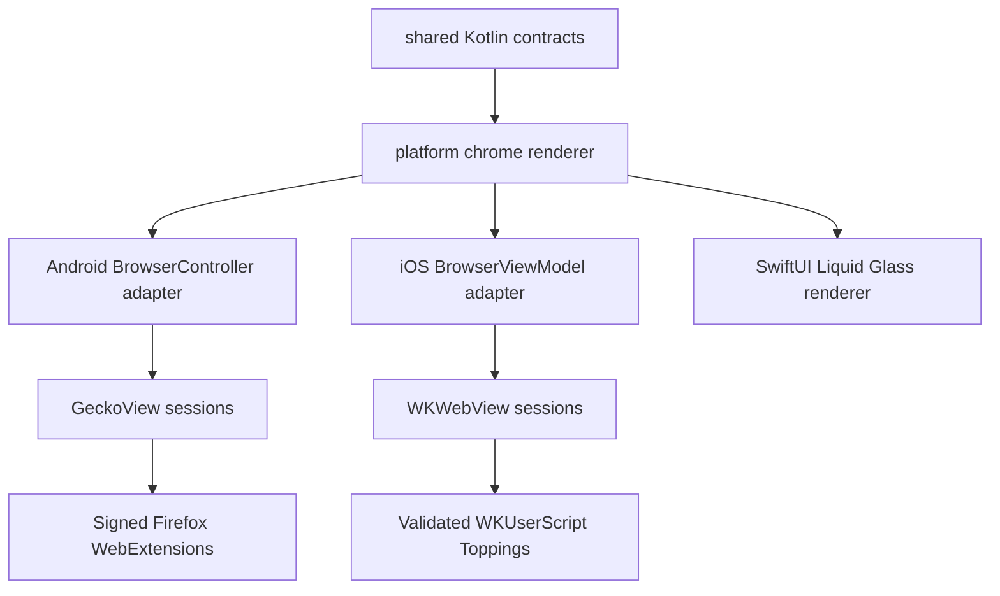

# Platform engines

Candy keeps browser behavior in Kotlin while treating the rendering engine and native chrome as
platform adapters.

## Implemented boundary

| Concern | Shared Kotlin | Android | iOS |
| --- | --- | --- | --- |
| Address resolution | `CandySharedFacade` and `BrowserUrlResolver` | Consumed by the Gecko browser | Consumed by `BrowserViewModel` |
| Browser chrome behavior | Tabs, session commands/events, core menu and gesture decisions | Existing Candy Compose chrome and tab overview | SwiftUI Liquid Glass chrome and tab overview consume the shared rules |
| Web engine | No engine type crosses the boundary | `BrowserController` owns an engine port per tab; Gecko stays behind the adapter | `BrowserViewModel` owns a WebKit adapter per tab |
| Customization | `Topping` metadata and injection plans | Firefox WebExtensions through GeckoView | Main-frame `WKUserScript` in a named content world |
| Visual language | Semantic state only | Candy Material theme | Native iOS 26 Liquid Glass, with an older-iOS material fallback |

The executable iOS target started as a vertical slice. It is not a separate reduced product: every
Candy menu, tab-overview mode and browser feature must move behind shared semantic contracts and be
implemented by the WebKit adapter. The exact acceptance surface and evidence are defined in
[`platform-feature-parity.md`](platform-feature-parity.md). Android types never enter `commonMain`.

## Android Gecko and extension invariants

- `GeckoRuntimeOwner` creates exactly one `GeckoRuntime` for the app process. Sessions are cheap,
  independently closeable adapters around it.
- Candy reports every selected-tab transition through GeckoView's active-tab API. This keeps
  Firefox extension `tabs`, `webNavigation`, CSS injection and script injection scoped to the
  same tab that Candy's shared chrome presents.
- Android builds launch the normal `MainActivity`, `BrowserScreen`, address bar,
  gestures, menus and tab overview. `BrowserController` binds a `GeckoSession` renderer to each tab;
  its guarded WebView factory cannot be entered while the Gecko engine flag is active.
- Gecko tab cards use `GeckoView.capturePixels()` and feed the bounded bitmap through Candy's
  existing preview quality, navigation-generation, private-tab and persistence gates. The same
  preview map continues to back hero, grid and list cards; private snapshots are never stored.
- Gecko is the only selectable Android product engine. The former
  `-Pcandy.useGeckoEngine=false` escape hatch has been removed. Remaining WebView code is
  migration-only and must not be reachable from a Gecko product flow; parity is not complete until
  that code is deleted together with all engine-based feature disables.
- Gecko's strict native tracking and safe-browsing protection is enabled as defense in depth. It
  does not replace Candy's bundled/user rule adapter or count as blocker parity by itself.
- Extension installation accepts only direct HTTPS URLs and delegates XPI parsing and Mozilla
  signature validation to GeckoView. The user must explicitly approve requested permissions;
  dismissal and lifecycle failure deny access.
- Listing, enabling, disabling, updating, private-browsing opt-in and uninstalling use
  `WebExtensionController`. Built-in extensions cannot be mutated from Candy's manager.
- Installing, enabling, disabling, updating or uninstalling an extension reloads the selected
  non-blank Gecko page so navigation-driven scripts and styles cannot miss an already open tab.
  Changing only private-browsing access does not reload a regular page.
- Settings presents the reusable extension manager as an overlay in the normal `MainActivity` and
  Candy chrome. It does not launch a second browser Activity or create a parallel address bar.
- Extension management is rejected from private management contexts. Private access is a separate,
  explicit switch for an extension installed from a regular context.
- Candy's bundled MV3 Topping host is separate from user-installed Firefox extensions. It uses
  GeckoView 140 `browser.userScripts` registrations for the supported local JS/CSS subset, remains
  disabled in private browsing, and is hidden from the Firefox extension manager. Regular first
  navigation waits for its bounded initialization gate so cold-start `document-start` scripts are
  not missed.
- GeckoView `140.0.20250707120347` is pinned because it supports this repository's Android 35 / AGP
  8.7 build. Upgrading GeckoView is a coordinated toolchain change, not a floating dependency bump.

## Next migration slices

| Slice | Move to shared Kotlin | Keep native |
| --- | --- | --- |
| Remaining page features | Reader, find, print, downloads, permission and blocking decisions | Gecko delegates and WebKit delegates |
| Profiles and persistence | Storage contracts and private-mode rules | Gecko/WKWebView storage containers |
| Address chrome | Complete state/actions, gesture rules and layout tokens | Android Compose and iOS Liquid Glass drawing/effects |
| Toppings | Remaining privileged grants and conformance fixtures | Gecko native bridge or WebKit script/message APIs |
| Downloads and permissions | Decision rules and observable state | Android intents/delegates and iOS system presenters |

Do not model Firefox extensions as Toppings: their capability and permission contracts are
different. Both may share catalog metadata later, but execution remains engine-specific.
