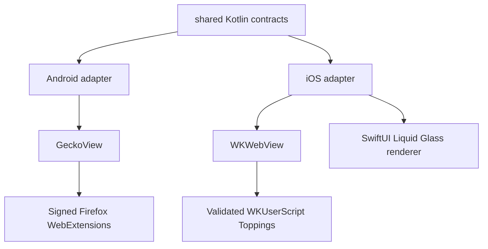

# Platform engines

Candy keeps browser behavior in Kotlin while treating the rendering engine and native chrome as
platform adapters.

## Implemented boundary

| Concern | Shared Kotlin | Android | iOS |
| --- | --- | --- | --- |
| Address resolution | `CandySharedFacade` and `BrowserUrlResolver` | Consumed by the Gecko browser | Consumed by `BrowserViewModel` |
| Browser chrome behavior | `BrowserChromeState`, `BrowserChromeAction`, `BrowserChromeController` | Platform UI dispatches browser commands | SwiftUI renderer dispatches the same actions |
| Web engine | No engine type crosses the boundary | One process-wide `GeckoRuntime`; one `GeckoSession` per browser session | `WKWebView` owned by the SwiftUI app |
| Customization | `Topping` metadata and injection plans | Firefox WebExtensions through GeckoView | Main-frame `WKUserScript` in a named content world |
| Visual language | Semantic state only | Candy Material theme | Native iOS 26 Liquid Glass, with an older-iOS material fallback |

The current iOS target is an executable vertical slice: address entry, back/forward,
reload/stop, `WKWebView`, and a bundled Topping all run in the simulator. It is not yet feature
parity with Android tabs, profiles, persistence, downloads, Reader Studio, or privacy tooling.
Those features should move behind shared contracts incrementally rather than importing Android
types into `commonMain`.

## Android Gecko and extension invariants

- `GeckoRuntimeOwner` creates exactly one `GeckoRuntime` for the app process. Sessions are cheap,
  independently closeable adapters around it.
- The settings entry opens the Gecko browser vertical slice. The existing Chromium/WebView browser
  remains the default while features migrate.
- Extension installation accepts only direct HTTPS URLs and delegates XPI parsing and Mozilla
  signature validation to GeckoView. The user must explicitly approve requested permissions;
  dismissal and lifecycle failure deny access.
- Listing, enabling, disabling, updating, private-browsing opt-in and uninstalling use
  `WebExtensionController`. Built-in extensions cannot be mutated from Candy's manager.
- Extension management is rejected from private management contexts. Private access is a separate,
  explicit switch for an extension installed from a regular context.
- GeckoView `140.0.20250707120347` is pinned because it supports this repository's Android 35 / AGP
  8.7 build. Upgrading GeckoView is a coordinated toolchain change, not a floating dependency bump.

## Next migration slices

| Slice | Move to shared Kotlin | Keep native |
| --- | --- | --- |
| Tabs and profiles | Models, reducers, persistence contracts, private-mode rules | Gecko/WKWebView session creation and storage containers |
| Address chrome | Complete state/actions and layout tokens | Android Compose and iOS Liquid Glass drawing/effects |
| Toppings | Parser, grants, match policy, stored model | Gecko extension APIs or WebKit script/message APIs |
| Downloads and permissions | Decision rules and observable state | Android intents/delegates and iOS system presenters |

Do not model Firefox extensions as Toppings: their capability and permission contracts are
different. Both may share catalog metadata later, but execution remains engine-specific.
