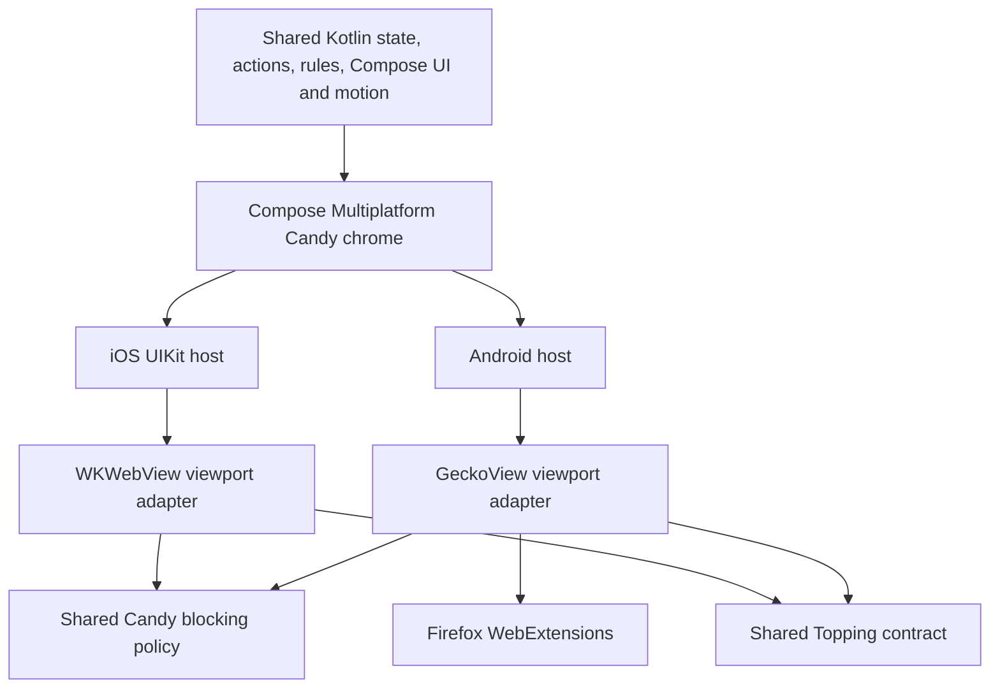

# Platform feature parity contract

Candy ships one browser product on Android and iOS. Platform engines and visual effects may differ;
browser behavior, information architecture and feature availability may not.

## Product invariants

- Android and iOS expose the same menu tree, tab actions, settings structure, gestures and browser
  feature states. A platform renderer may use native controls, but it must consume the same shared
  semantic model and preserve action order, labels, enabled rules and accessibility meaning.
- Android keeps the existing Compose Candy chrome while it is moved incrementally into commonMain.
  iOS renders that common Compose chrome around a native WKWebView viewport. Platform-specific
  Liquid Glass is a later rendering treatment at explicit theme/effect seams, not a parallel UI.
- Every non-blank tab card uses a real snapshot from the owning engine. Gecko uses a compositor
  screenshot and WebKit uses `takeSnapshot`; neither platform substitutes a title placeholder after
  a successful page render. Capture results are accepted only for the same tab and navigation.
- Regular previews follow Candy's bounded preview persistence. Private previews remain memory-only
  and are destroyed with the private session.
- Toppings use one metadata, matching, grant and persistence contract on both platforms. Gecko and
  WebKit may use different isolated script/message mechanisms. Firefox WebExtensions remain an
  additional Android-only capability and are never presented as Toppings.
- Candy's bundled and user blocking decisions remain the policy source on both platforms. Gecko
  implements them through Gecko request/content-script adapters; WebKit compiles the supported
  network subset to `WKContentRuleList` and applies Candy-owned cosmetic scripts. Platform-native
  tracking protection may add protection but may not replace Candy rule semantics.
- A feature is not complete when its action is hidden, disabled, backed by a placeholder, or routed
  to the legacy Android WebView.

## Required parity surface

| Surface | Shared owner | Gecko adapter | WebKit adapter |
| --- | --- | --- | --- |
| Address, navigation and search | URL rules, chrome state, commands | navigation/progress delegates | navigation delegates |
| Tabs and exact card previews | lifecycle, ordering, Hero/Grid/List layout and motion rules | compositor bitmap capture | `WKWebView` snapshot capture |
| Menu and settings hierarchy | ordered semantic models and Compose renderer | Android host | iOS UIKit host |
| Profiles, private mode and restore | profile/session/storage rules | Gecko context/private sessions | website data stores/process pools |
| History, favorites and snooze | repositories and mutation rules | platform scheduling edge | platform scheduling edge |
| Candy Trails and Site Capsules | graph/capsule domain and navigation policy | Gecko history/navigation delegates | WebKit history/navigation delegates |
| Link Peek and external preview | preview lifecycle and promotion policy | transient Gecko session | transient WKWebView session |
| Find, Reader, print and translation | action/session policy | Finder, extraction and PDF/print delegates | find, JS extraction and print delegates |
| Downloads, uploads and sharing | decision and observable request state | response/prompt delegates and Android intents | download delegates and iOS presenters |
| Permissions, auth and external apps | origin, retention and routing rules | Gecko permission/prompt/navigation delegates | WebKit delegates and iOS permissions |
| Blocking, Candy Rules and Privacy X-Ray | filter decisions, aggregation and exceptions | request/content-blocking bridge | content-rule/script/message bridge |
| Toppings and GM APIs | parser, grants, dependencies, values and commands | app-owned built-in extension bridge | isolated content worlds/message bridge |
| Media, fullscreen and PiP | media identity and transition rules | Gecko media/fullscreen delegates | WebKit media/fullscreen delegates |
| Appearance, wallpapers and accessibility | shared tokens, Compose drawing and semantics | Android effects | iOS Liquid Glass effects |
| Sync, import and export | shared protocol/repositories | Android platform I/O | iOS platform I/O |
| Firefox extensions | not shared with Toppings | signed XPI manager and Gecko APIs | not applicable by Apple engine policy |

## Completion gates

| Gate | Required evidence |
| --- | --- |
| Contract | Same shared state/action model drives both platform surfaces |
| Behavior | Rule/unit tests cover common valid, invalid, stale and private cases |
| Android | Focused API 34+ Gecko instrumented tests; no Chromium provider load |
| iOS | Focused iPhone simulator tests against real `WKWebView` |
| Visual | Golden/screenshot comparison for address chrome, every menu level and each tab overview mode |
| Preview | Navigated page pixels appear in Hero/Grid/List cards on both engines; stale/private tests pass |
| Blocking | Same deterministic request corpus produces at least the legacy Android allow/block result set |
| Toppings | Same conformance fixtures pass for metadata, match/exclude, run-at and every supported GM grant |
| Release | No legacy Android WebView dependency or engine-based feature-disable branch remains |

Feature parity is reported as complete only after every applicable row and gate passes. Android's
Firefox extension row is an explicit additive exception, not a cross-platform parity requirement.

## Migration state

The shared Compose root is active on iOS. Android deliberately retains the production Candy
composables until each surface can move to `commonMain` without losing previews, motion, menus,
accessibility or private-mode behavior. During this strangler migration, common state/action rules
are authoritative, but visual parity is not yet complete.
