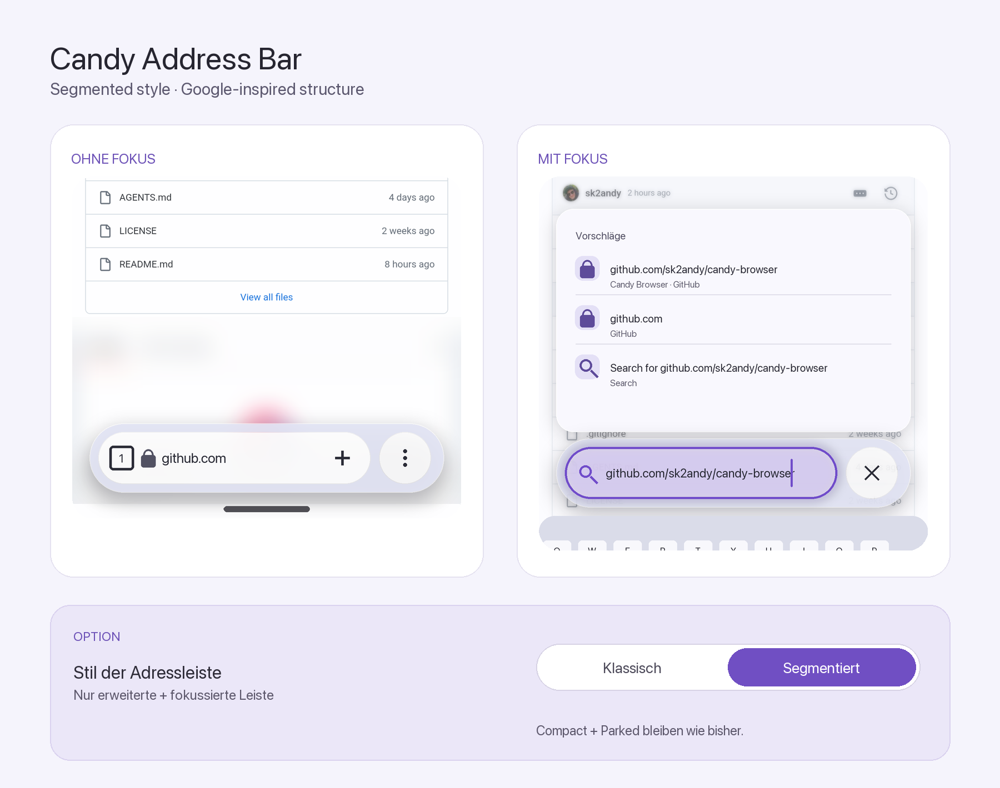
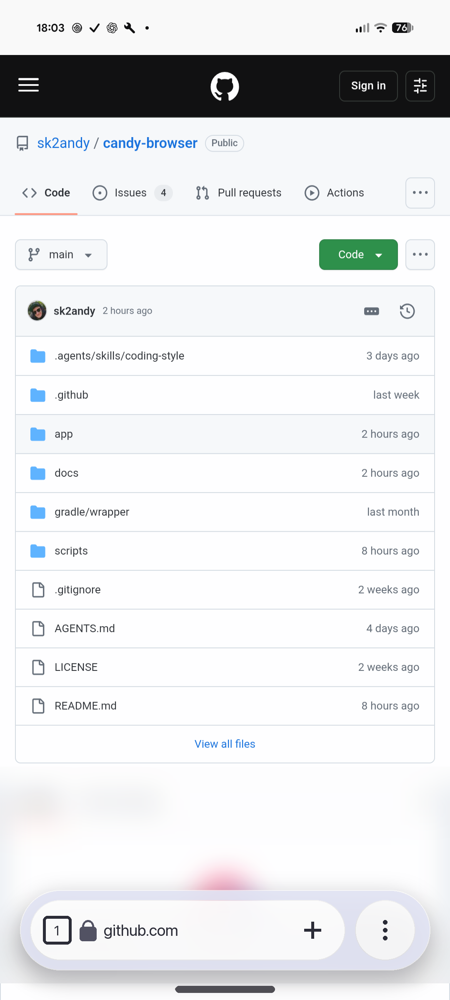
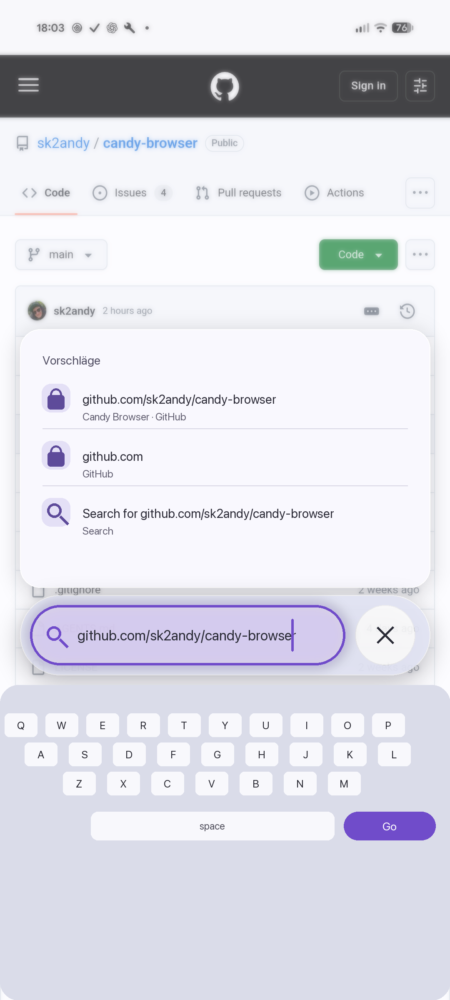

# Segmented address bar concept

This concept adapts the structural idea of Google's segmented search bar to Candy's existing frosted
Material presentation. One outer capsule groups a long primary pill with a separate circular action pill.

| State | Primary pill | Action pill |
| --- | --- | --- |
| Expanded, unfocused | Configured actions, tab count, address, and new-tab action | Fixed More action |
| Expanded, focused | Search icon and full-width editor | Close editor |

The shared outer capsule keeps both segments visually connected. Candy theme colors, frosted opacity,
shape settings, and motion tokens remain authoritative. Focus outlines only the primary editor pill.
The segmented layout uses the same 8 dp spacing around and between its 48 dp controls, resulting in a
64 dp expanded bar height. The outer corner radius is the inner radius plus that inset, keeping both
curves concentric.

The optional appearance setting should expose **Classic** and **Segmented** styles. It affects the expanded
address bar with and without focus. Compact, parked, overview, command-feedback, external-preview, and
find-in-page capsules retain their current geometry and behavior.

## Individual states

