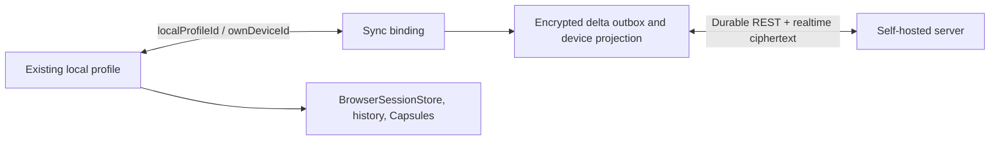

# Candy Browser sync integration

Candy Browser implements Candy Sync on Android and iOS through profile bindings and writable device profiles.
The current device binds to one existing local profile. That profile keeps its own icon and
normal local behavior, gains a sync badge, and is not duplicated in the profile switcher. Every
other active device appears beside local profiles with its encrypted name, freely selected shared
icon, accent, and a local sync badge.

## Current-device profile binding

Setup defaults to the active local profile and lets the user select any existing local profile. The
encrypted Android device identity is then associated locally with that profile ID:



The binding is local metadata. The server never receives the Candy profile ID. The bound profile
remains a local profile: history, Candy Trails, Site Capsules, WebView isolation, snoozing, and
normal session persistence keep their existing owners. Only its non-private HTTP(S) tab projection
is synchronized. Session-ephemeral federated-login popups and their active opener are excluded from
outbound mutations and protected from inbound reconciliation until the login window closes.

During first binding, Candy assigns stable sync IDs to eligible existing tabs and publishes them.
Remote tabs already present for the device are merged into the same local profile. Private tabs and
untracked blank, internal, local-file, and active federated-login popup tabs are preserved locally.
Once a synchronized tab has been acknowledged, a later remote close removes it locally unless it is
temporarily protected by an active federated-login flow. This distinguishes initial migration from
a real remote deletion without interrupting an authenticator or password-manager round trip.

The binding cannot point at an incognito context, and a profile cannot be deleted while actively
bound. Legacy Android sync settings without a profile ID migrate to the active local profile.

## User model

Selecting a synced profile opens that device's tab snapshot inside the normal Candy tab UI. The
profile is not read-only: a mobile client can open, navigate, pin, reorder, and close its tabs. The desktop
extension applies those changes when the target browser is available.

```mermaid
flowchart LR
    A[Android synced profile] -->|Open / navigate / pin / reorder / close| R[Encrypted mutation queue]
    R -->|CAS encrypted v2 delta| S[Self-hosted server]
    S -->|Committed WebSocket frame or REST pull| E[Chromium or Firefox extension]
    E -->|Apply safe HTTP(S) tab diff| D[Desktop browser tabs]
```

The server records the authenticated writer separately from the target device. An Android device
may therefore update a desktop device's profile without impersonating it.

## Runtime ownership boundary

Synced profiles use a `BrowserProfile`-compatible runtime projection so existing tab and browser
engine interaction remains native. The projection is deliberately excluded from local ownership
stores. Reconciled navigation is dispatched to a resident Gecko session immediately; non-resident
tabs remain lazy and load their reconciled URL when their session is first created.

| Data | Local profile | Synced profile |
| --- | --- | --- |
| Tab/browser-engine interaction while running | Yes | Yes |
| `BrowserSessionStore` tabs and profile | Yes, including stable sync IDs for a bound profile | No |
| Incognito tabs | Yes | Never |
| Candy Trails, snooze, local history, Recall | Yes | Not persisted for synced tabs |
| Site Capsules and isolated WebView storage | Yes | Not owned by synced profiles |
| Encrypted sync cache/outbox | No | Yes |

`BrowserProfile.syncedDeviceId` identifies a runtime projection. `BrowserTab.syncCandyId` is the
stable cross-client tab identity; the Android runtime tab ID remains an implementation detail.

An empty `about:blank` tab is kept locally until its first valid HTTP(S) navigation. It then becomes
an encrypted `Open` mutation. `file:`, browser-internal, malformed, private, and session-ephemeral
federated-login URLs never enter the sync payload.

## Supported mutations

| Mobile action | Durable logical mutation | Target result |
| --- | --- | --- |
| Open a URL | `Open` | Create or adopt the stable `candyId` |
| Navigate, including SPA history updates | `Navigate` | Update URL and bounded title |
| Pin or unpin | `SetPinned` | Update pinned state |
| Drag to reorder | `Reorder` | Reconcile the ordered stable IDs |
| Close | `Close` | Remove the matching desktop tab |

Gecko commit and same-document navigation events are debounced before entering the serialized
repository. Remote hydration is marked until commit so engine callbacks cannot echo the received
URL back as a new mutation. A local HTTP(S) navigation is protected from inbound reconciliation
immediately and remains protected until the same target device, stable tab ID, and normalized URL
appear in repository state. The repository folds pending mutations into its observable state
immediately, persists them in a Keystore-protected cache, and retries them after reconnecting.
Android instrumentation covers this race at both boundaries: controller tests exercise deterministic
event ordering, while the address-bar E2E launches the real activity, submits a search through the
visible editor, loads it in Gecko, injects the stale synchronized URL, and verifies that neither the
selected tab nor the rendered engine returns to the old page.

## Conflicts and delivery

Every target profile has a monotonically increasing revision. With protocol v2, Android encrypts
one logical mutation and sends it as a compare-and-swap delta. On a revision conflict, it pulls the
latest ordered deltas, replays the logical mutation by stable ID, and creates a new attempt. The v1
compatibility path retains encrypted snapshot CAS for servers that do not advertise the complete v2
feature set and whose workspace protocol floor has not been promoted.

A prepared delivery attempt stores its exact change ID, mutation ID, base revision, nonce, and
ciphertext before network I/O. A timeout or process restart reuses those exact bytes. This prevents
a lost response from producing different ciphertext under one idempotency key. A confirmed CAS
conflict retires the attempt before a fresh encrypted attempt is created.

### V2 authenticated encryption

Android, iOS and the WebExtension implement the same v2 derivation and AAD contract:

```text
deltaKey = HKDF-SHA-256(
    workspaceKey,
    salt=UTF8(JSON.stringify([workspaceId, targetDeviceId])),
    info=UTF8("candy-sync/v2/payload/tab-delta"),
    output=32)

aad = JSON.stringify([
    "candy-sync-change", cryptoVersion, keyVersion, schemaVersion,
    workspaceId, writerDeviceId, changeId, mutationId,
    "tabs", targetDeviceId, "delta", baseRevision
])
```

AES-256-GCM uses a fresh 12-byte CSPRNG nonce for every new mutation. Plaintext repeats
`mutationId` and `targetDeviceId`; both must match authenticated metadata after decryption. Workspace,
writer, target, operation, identities, and revision-chain substitution therefore fail authentication.

## Shared device icons

[`device-icons-v1.json`](../../sync/protocol/device-icons-v1.json) is the canonical catalog used by
iOS and Android local-profile pickers, shared sync settings, and both extension builds. Its 54 emoji
icons therefore cannot drift between clients. Users freely select an icon; the encrypted descriptor
stores only:

```json
{
  "schemaVersion": 1,
  "catalogId": "computer",
  "accentHue": 312
}
```

Both mobile builds package the versioned JSON. Unknown catalog IDs fail closed.
The small sync badge is local UI state and is not part of user-controlled encrypted metadata.

## Setup and secrets

The Sync settings page requests:

- the exact self-hosted endpoint;
- server username and one-time enrollment password;
- the existing local profile represented by this Android device;
- this device's encrypted display name, icon, and palette-picked accent color;
- the E2EE passphrase and confirmation.

The device-accent palette uses a fixed, runtime-compatible row layout. Opening Sync from the real
browser Settings route must render the complete page without depending on experimental Compose
flow-layout ABI.

The server password and E2EE passphrase must differ. Neither input is saved. The passphrase never
leaves the device, is immutable for the workspace, cannot be changed or recovered in either protocol
version, and is needed to enroll future devices. Losing it can make the workspace unrecoverable. Each secret field has an explicit
show/hide control, and the settings page remains scrollable above the on-screen keyboard.

Each platform generates its own P-256 device key locally. Android protects the vault and cache with
Android Keystore; iOS stores vault material in a ThisDeviceOnly Keychain item and protects the atomic
cache with a separate Keychain-backed AES-GCM key. Server responses are parsed with exact keys, bounded
sizes, authenticated metadata, and strict HTTP(S) URL policy.

Remote HTTP endpoints are stored only as provisional setup endpoints. Android performs
unauthenticated discovery and sends no Basic credential or bearer token until the server reports
`allowHttp: true`. That report requires `CANDY_SYNC_ALLOW_HTTP=true` server-side. It is a deliberate
cleartext opt-in, not transport security; HTTPS remains the recommended deployment.

## Foreground and background behavior

The controller starts realtime when Candy Browser enters the foreground and closes the socket when
the activity stops. While foregrounded, a single-use 45-second ticket authenticates the WebSocket;
contiguous committed frames apply immediately. Duplicate cursors are ignored; missing or
non-contiguous cursors trigger ordered REST catch-up from the last durably stored v2 cursor.
Reconnect uses bounded backoff.

The controller also refreshes on foreground start and every 15 seconds while active. Local mutations
push immediately; offline writes remain durable and replay after a later refresh. **Sync now** offers
an explicit recovery action. Android does not keep a permanent background socket and does not wake a
closed app continuously. REST remains durable truth; realtime is a foreground latency accelerator.

## Protocol floor

Android selects v2 only when discovery advertises version 2, `tab-mutations-v2`, and `realtime`.
The first committed v2 delta atomically raises that workspace's protocol floor. Later v1 tab writes
fail with `409 protocol_upgrade_required`; clients must upgrade rather than fall back. V1 reads stay
available, and v1/v2 cursors remain separate. Before promotion, accepted v1 writes advance the v2
revision baseline to prevent divergent successors.

## Code map

| Path | Responsibility |
| --- | --- |
| `shared/.../sync/CandySyncRepository.kt` | Shared enrollment, pull, CAS, outbox, retry, realtime and observable state |
| `shared/.../sync/SyncProtocolCodec.kt` | Shared strict protocol JSON and authenticated metadata |
| `shared/.../sync/SyncTabRules.kt` | Shared deterministic mutation and URL rules |
| `app/.../sync/SyncCrypto.kt` | Android P-256, HKDF, AES-GCM and Argon2 adapter |
| `data/sync/AndroidSyncStores.kt` | Keystore-backed vault and encrypted cache |
| `iosApp/CandyIos/IosSyncPlatform.swift` | CryptoKit, Keychain cache/vault and dispatch adapters |
| `iosApp/CandyIos/IosSyncTransport.swift` | URLSession REST and WebSocket adapter |
| `browser/SyncedProfileRuntimeRules.kt` | Runtime profile/tab projection and reconciliation |
| `shared/.../ui/settings/SyncSettingsPage.kt` | Shared setup, immutable-passphrase warning, status and device list |

## Verification

```sh
./gradlew testFullDebugUnitTest testFossDebugUnitTest
./gradlew lintFullDebug lintFossDebug assembleFullDebug assembleFossDebug
./sync/scripts/test-all.sh
```

Android security instrumentation requires a dedicated API 34+ emulator with an explicit
`ANDROID_SERIAL`. The repository suite covers known-answer crypto, tampering, wrong passphrases,
strict parsing, Keystore restart behavior, offline retry, lost-response idempotency, and CAS replay.
The MainActivity settings-flow suite also enters Sync through the real browser menu and verifies the
page renders on-device.
Controller instrumentation covers Gecko `Open`/`Navigate`, SPA history changes, first-load hydration
without echo, stale linked-state rejection during local navigation, rapid superseding remote
navigation, and remote navigation of an already resident Gecko session.
`./sync/scripts/test-android.sh` provisions its own disposable API 35 AVD, sets the serial explicitly,
runs the sync unit/UI/security suite, and deletes the AVD afterward.
