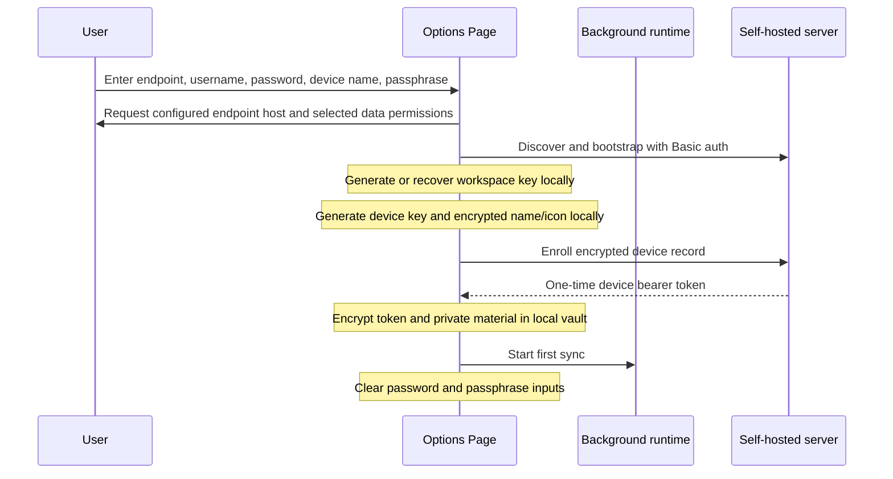

# Candy Sync browser extension

The Candy Sync WebExtension adds encrypted desktop-tab synchronization to Chromium and Firefox
without a toolbar popup. Configuration and status live on a full Options Page opened from the
browser's normal extension settings. Protocol v2 sends encrypted logical tab mutations; realtime
notifications reduce active-session latency, while REST and a periodic alarm recover missed work.

## Current scope

| Capability | Status |
| --- | --- |
| Self-hosted endpoint, username, one-time password, device name | Implemented |
| Locally generated workspace key and per-device P-256 identity | Implemented |
| Immutable passphrase recovery and encrypted local vault | Implemented |
| Encrypted device name and versioned device icon descriptor | Implemented |
| HTTP(S), non-private tab capture and encrypted upload | Implemented |
| Chromium Manifest V3 service worker | Implemented |
| Firefox non-persistent background page | Implemented |
| Pulling and applying changes targeting this desktop device | Implemented |
| Cross-device open, navigate, pin, reorder, and close | Implemented |
| V2 durable delta outbox, REST catch-up, and WebSocket notifications | Implemented |
| Freely selectable shared Android-compatible profile icon | Implemented |
| Bookmark merge and direct pairing | Not implemented |

The disabled bookmark row reserves the product direction without requesting browser access before
bookmark merge exists. Tab-group assignments are included in tab snapshots when group sync is selected.

## Build and load

From `sync/extension/` with Node.js 20.19 or newer:

```sh
npm ci
npm run verify
```

Build artifacts appear in `dist/chromium/` and `dist/firefox/`.

| Browser | Development loading path |
| --- | --- |
| Chromium | `chrome://extensions` → Developer mode → Load unpacked → `dist/chromium` |
| Firefox | `about:debugging#/runtime/this-firefox` → Load Temporary Add-on → `dist/firefox/manifest.json` |

Open the extension's Options Page from the browser's extension-management page. There is no toolbar
action and no popup.

## Setup flow



For the first device, the extension creates the workspace key and immutable recovery envelope. A
later device downloads that envelope and unlocks it locally using the same passphrase. It then
creates its own independent device key and encrypted name/icon. No passphrase is sent to the server.

The server password and E2EE passphrase must differ. The password is used only during enrollment and
is not persisted. The passphrase is immutable for the workspace, cannot be changed or recovered in
either protocol version, is never persisted, and must be entered again after browser restart to
unlock sync.

Browser packages require HTTPS for remote endpoints and grant HTTP host access only for localhost.
The protocol client retains the server-advertised `allowHttp` guard for development integration,
but the Options Page blocks remote HTTP before requesting permissions or sending credentials.

## Device icon

The Options Page loads the versioned
[`device-icons-v1.json`](../../sync/protocol/device-icons-v1.json) catalog and lets the user freely
choose among the same 54 emoji icons used by Android profiles. The descriptor contains only the
catalog ID and an accent hue. It is encrypted with a device-presentation key derived from the
workspace key. Both name and icon envelopes are authenticated against the exact public-key
fingerprint, so swapping presentation data between device records fails decryption.

Unknown catalog IDs fail closed. The sync badge shown by Candy Browser is separate local UI state
and cannot be spoofed by the descriptor.

## Runtime behavior

The background runtime reacts to tab creation, removal, movement, updates, browser startup, and
permission changes. Multiple events enter one serialized state machine. On a v2-capable server,
they become encrypted `open`, `navigate`, `close`, `reorder`, and `set-pinned` mutations. Consecutive
navigation changes may coalesce; a close may supersede pending updates when their revision chain is
contiguous.

Chromium maintains a best-effort WebSocket while its service worker is active and sends a
20-second application heartbeat. Firefox uses the same connection while its non-persistent event
page remains loaded. Either runtime may be suspended at any time. A one-minute alarm, startup and
tab events, detected socket gaps, and explicit **Sync now** all resume REST catch-up from the last
durably applied v2 cursor. Correctness never depends on a permanently running background context.

Turning tab sync off closes realtime delivery and stops local uploads. The extension records only
the stable tab IDs present at that boundary. When tab sync is enabled again, it emits encrypted
opens for new IDs, closes for missing IDs, and explicit navigation, pin, and order changes for
surviving IDs. This reconciles changes made while disabled without storing URLs or titles as
plaintext. Pull pagination rejects repeated, cyclic, and non-progressing cursors.

The network client invokes the platform `fetch` function through its owning browser global. This
keeps native Web API receiver rules consistent between Options Pages, Chromium service workers,
and Firefox background pages.

Before upload, capture rules:

- reject private/incognito tabs;
- retain only `http:` and `https:` URLs;
- reject malformed and internal browser URLs;
- truncate titles to the protocol limit;
- order tabs deterministically;
- remove group assignments when group sync is disabled.

The extension writes an encrypted change to a durable local outbox before upload. A retry reuses its
change ID, mutation ID, nonce, and ciphertext. The server can therefore accept repeated delivery
idempotently without risking AES-GCM nonce reuse from re-encryption.

Before uploading its own browser state, the extension pulls and applies pending changes targeting
its device profile. Stable `candyId` values are persisted in `storage.local`, so normal navigation
does not create a new logical tab. A syncable `pendingUrl` takes precedence while navigation is
loading, and transient blank or internal states retain the existing identity until the browser
reports a committed destination. A remote navigation whose normalized URL already matches the
desktop tab's current or pending URL updates logical sync state without calling the browser's URL
update API, so title-only reconciliation cannot reload or autoplay an existing page. Reconciliation
creates, updates, pins, moves, and removes only eligible HTTP(S) tabs; incognito, internal,
local-file, and unmanaged tabs are preserved.

## Protocol v2 encryption and delivery

V2 derives a target-specific tab-delta key with HKDF-SHA-256:

```text
salt = UTF8(JSON.stringify([workspaceId, targetDeviceId]))
info = UTF8("candy-sync/v2/payload/tab-delta")
key  = HKDF-SHA-256(workspaceKey, salt, info, 32 bytes)
```

AES-256-GCM authenticates this exact JSON-array AAD:

```text
["candy-sync-change", cryptoVersion, keyVersion, schemaVersion,
 workspaceId, writerDeviceId, changeId, mutationId,
 "tabs", targetDeviceId, "delta", baseRevision]
```

The encrypted plaintext repeats `mutationId` and `targetDeviceId`; clients require both to match the
authenticated envelope after decryption. Substituting workspace, writer, target, identity,
operation, or revision chain therefore fails authentication. Every new encryption uses a fresh
12-byte CSPRNG nonce; retries reuse the already persisted envelope.

`POST /v2/sync/push` is the durable commit. `GET /v2/sync/pull` is the authoritative ordered recovery
path. A 45-second, single-use ticket opens WebSocket `/v2/realtime`; committed frames may be applied
directly only when cursor and target revision are contiguous. Gaps, malformed frames, socket loss,
and slow-consumer disconnects trigger REST recovery.

V2 is selected only when discovery advertises version 2 plus `tab-mutations-v2` and `realtime`.
The first v2 commit raises the workspace protocol floor. A client must treat
`409 protocol_upgrade_required` as a mandatory upgrade signal; it must not fall back to v1 writes.
V1 snapshot state and cursors remain separate for compatibility before promotion and for reads.

## Permissions

| Permission | Lifecycle |
| --- | --- |
| `storage`, `alarms` | Baseline extension permissions |
| `tabs` | Requested when tab sync is selected |
| `tabGroups` | Requested when group sync is selected and supported |
| Endpoint host access | Requested for the configured scheme and host during explicit setup |

There are no content scripts and no web-accessible resources. Permission add/remove events update
effective sync state. Bookmark access is deliberately absent from both manifests until bookmark
synchronization is implemented; the Options Page exposes only a disabled roadmap row.

Chromium permission requests contain only standard `permissions` and `origins`. Firefox builds add
the Firefox-only `data_collection` field declared by their Gecko manifest. HTTPS is declared for
user-selected remote endpoints; HTTP is declared only for `localhost`, `127.0.0.1`, and `[::1]`.
Setup requests only the configured scheme and host after direct user action. The requested pattern
intentionally omits the port because Firefox rejects ports in match patterns. Entering remote HTTP
shows an inline block reason before any permission or credential request.

## Local storage

| Storage area | Contents |
| --- | --- |
| `storage.local` | Non-secret settings, encrypted vault, encrypted outbox, redacted status |
| `storage.session` | Unlocked vault secrets for the current browser session |
| `storage.sync` | Never used |

WebExtensions do not expose one portable OS keychain API across Chromium and Firefox. The local
vault protects a locked browser profile, not a running unlocked profile against malware, debugging,
or a compromised extension update.

## Status model

The Options Page reports `unconfigured`, `locked`, `ready`, `syncing`, `current`, `offline`,
`auth-error`, `crypto-error`, `permission-required`, or `incompatible`. Status text is deliberately
redacted and must not include secret or browsing plaintext.

## Verification

```sh
npm run typecheck
npm test
npm run build:chromium
npm run build:firefox
npm run test:build
npm run lint:manifests
npm run verify:reproducible
```

Use `./sync/scripts/test-all.sh` from the repository root for the complete Docker-isolated server,
extension, protocol, reproducibility, audit, and plaintext-canary gate.

See [`../../sync/extension/README.md`](../../sync/extension/README.md) for contributor commands and
[`../../sync/extension/SECURITY.md`](../../sync/extension/SECURITY.md) for client-side invariants.
